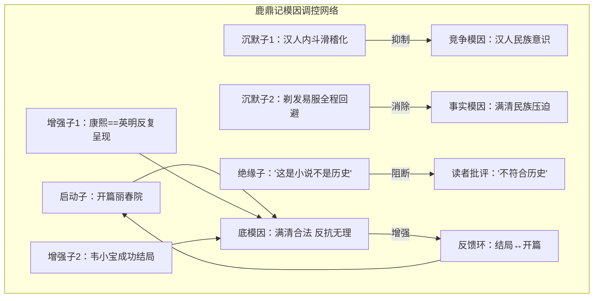

# 文学作品模因图谱 3.0 —— 基于人类基因组图谱类比的结构设计

> 版本：3.0
> 定位：从"分析工具"升级为"产品结构标准"
> 核心类比：如同 HGP 从散装基因测序升级为完整基因组图谱，本文定义「一套文学作品模因图谱应该包含什么」
> 核心改进：2.0 → 3.0 的变更——增加类比的诚实边界声明（二章）、每个L层的类比诚实框、以及贯穿全流程的质量控制体系（七章）

---

## 一、为什么需要 3.0

### 1.1 现有体系的问题诊断

现有 v2.1 文学作品模因图谱有一个隐含的结构性矛盾：**它的六层级既是分析流程，又是产品结构。**

| 维度 | 现有六层级 | 问题 |
|------|-----------|------|
| 事实锚定 | 分析的第一步 | 不应该是产品的一部分——它是方法论，不是产出物 |
| 根模因层 | 分析结论的核心 | 位置正确，但缺乏内部结构——一个"根模因"内部太粗糙 |
| 主控传播复合体 | 核心拆解单元 | 这里开始接近产品结构，但分类维度不够系统 |
| 受众驯化效果 | 影响分析 | 混淆了"模因本身的结构"和"模因对宿主的影响" |
| 互作网络 | 系统分析 | 正确但层次不对——互作应该建立在更精细的结构单元之上 |
| 终极判定（原红丸定位） | 最终定性 | 正确，但应该基于更精确的模因图谱推导 |

**根本问题**：现有六层级把"如何做分析"（方法）和"分析完长什么样"（产品）混在了一起。

### 1.2 HGP 的启示

人类基因组计划的结构层次：

```
染色体（整体结构）
   ├── 基因（功能单元）
   │    ├── 外显子（编码序列）
   │    ├── 内含子（非编码但可能有调控功能）
   │    └── 启动子（调控开关）
   ├── 非编码区（调控区域、保守元件）
   ├── 重复序列（结构特征）
   └── 端粒/着丝粒（结构元件）

跨个体比较 → 单核苷酸多态性（SNP）、拷贝数变异（CNV）
跨物种比较 → 比较基因组学：同源基因、物种特有关系
```

关键原则：
1. **先有完整序列**（全量测序），再做功能注释
2. **功能注释需要标准化**（GENCODE 标准）
3. **结构层次清晰**（染色体→基因→外显子→碱基）
4. **调控网络独立于基因本身**（不是基因的一部分）
5. **比较分析建立在对单个基因组的完整理解之上**

### 1.3 核心区分：分析流程 vs 产品结构

```
分析流程（怎么做）                    产品结构（长什么样）
─────────────────                    ─────────────────
阶段一：检索校准（v3 Prompt）         L1：模因序列层（全量清单）
阶段二：深度拆解（六层级分析）          L2：模因结构层（染色体分组）
阶段三：闭环验证                       L3：模因功能层（功能注释）
                                      L4：模因调控层（表达调控网络）
                                      L5：模因演化层（跨作品比较）

两者关系：
流程产出结构，结构指导流程。
就像测序仪（流程）产出基因组序列（结构），
而基因组序列反过来指导下一轮测序（靶向测序）。
```

---

## 二、类比的边界和使用守则

整个五层结构使用人类基因组计划（HGP）作为核心类比。这个类比有强大的解释力，但也有关键断裂。在使用前必须清楚认知它的**成立条件**和**不成立条件**。

### 2.1 类比成立的部分

| 类比维度 | 成立条件 | 为什么成立 |
|---------|---------|-----------|
| **层次嵌套** | 整体→部分→功能的分解方式 | 基因组的结构层次（基因组→染色体→基因→碱基）和模因的结构层次（作品→模因染色体→模因基因→模因位点）在形式上同构 |
| **功能注释** | 标准化的字段式描述 | GENCODE对基因的标注方式（ID、定位、功能、表达条件）可以直接迁移为模因基因的注释格式 |
| **调控网络** | 表达受多层因素控制 | 基因的表达受启动子/增强子/沉默子调控，模因的表达也受叙事策略/受众状态/社会语境调控 |
| **比较分析** | 跨个体比较发现规律 | 单一基因组的解释力有限，跨个体/跨物种的比较才能发现变异和演化规律 |

### 2.2 类比断裂的部分

| 类比维度 | 断裂点 | 后果 | 补偿措施 |
|---------|-------|------|---------|
| **碱基的客观性** | DNA碱基是化学实体，A/T/C/G由测序仪无争议读出；模因"碱基"是分析者的判断结果 | 不同分析者的L1产出不可自动比对 | 层0（原始素材）+层1（偏差标注）的两层结构，让偏差判断可追溯可争议。同时引入"覆盖度指数"量化L1的完成度（见7.1） |
| **染色体恒定性** | 人类每条染色体的编号、长度、基因顺序在同物种内固定；模因的"五条染色体"是功能分类而非物理结构 | 不同作品的"CHR-01"不是同一个东西 | 染色体编号标准化——CHR-01始终对应"身份定位域"，但其内容因作品而异 |
| **序列比对** | 生物学有BLAST、Clustal等工具进行精确序列比对；模因没有等价的比对方法 | 同源/趋同的判定没有客观标准 | 四步判定流程（6.0节）输出倾向性判断而非确定性结论，必须附带置信度 |
| **参考基因组的稳定性** | 人类参考基因组是固定的（GRCh38），所有新测序结果与之比对；模因分析没有这样的固定参考系 | "与参考基因组比对"的思路不可用 | 不同作品的模因图谱只能互相比对，无法与一个"标准模因图谱"比对 |

### 2.3 使用守则

1. **术语是可借用的，但借用的边界必须标清**——"碱基""染色体""基因""启动子"等术语在使用时，必须默认附带一条脚注级别的诚实性说明
2. **类比的目的是启发理解，不是论证合法性**——不要在论证中用"因为基因组学也用同样的术语，所以我的方法也是科学的"这种循环
3. **在类比断裂处，框架必须显式标注它的处理方法**（如L5的置信度标记、同源/趋同判定的不确定性输出）

---

## 三、五层产品结构（深化版）

### L1：模因序列层——全量测序

**对应 HGP**：全基因组鸟枪法测序，不挑不拣，先拿到完整的碱基序列。

> **类比诚实性**：L1使用"测序""碱基"等术语，但模因的"碱基"不是化学实体而是分析者的判断结果。L1拆为层0（原始素材，有客观锚点）和层1（偏差标注，可追溯事实依据），试图弥补精确性的不足。详见2.2节。

**定义**：对目标作品进行全量模因测序，列出所有可识别的模因单元，不筛选、不排序、不评价。

**重要限定**：模因碱基的识别依赖于分析者的判断，不同分析者可能给出不同结果。L1的目标是**可追溯、可争议**，而非**绝对客观**。每个碱基的识别必须附带定位依据，以便在争议时可以回溯验证。

#### 2.1 两层结构：原始素材层 + 偏差层

模因碱基不是单一的层级。为了避免粒度混乱（把台词、命题、叙事框架混在一起），L1拆为两层：

```
原始素材层（层0）          偏差层（层1）
─────────────              ────────────
可定位的作品原始内容       该内容与事实锚定底表的偏差
（原文/台词/设定）          （偏差类型 + 偏差方向）
```

**层0 —— 原始素材**：作品中可精确定位的最小内容单元。只登记，不评价。

| 素材类型 | 定义 | 收录标准 | 示例 |
|---------|------|---------|------|
| **台词** | 作品中可独立引用的原文表述 | 任何可能被读者记住并复用的表述 | "鸟生鱼汤"（第X回） |
| **设定** | 作品对世界观/人物/事件的基本陈述 | 任何涉及事实判断的设定 | 康熙是英明圣君（贯穿全书） |
| **叙事选择** | 作品的叙事视角、情节编排策略 | 任何非中性的叙事方式 | 全程韦小宝第一人称视角（全书） |
| **符号** | 作品中承载隐喻功能的物象/场景 | 任何在作品中被赋予特殊含义的元素 | 四十二章经（第X回起出现） |

**层1 —— 偏差标注**：将层0的每个素材与事实锚定底表对照，标注偏差。偏差是客观可标注的——不判断"服务于什么立场"，只判断"和事实是否一致"。

| 偏差类型 | 定义 | 标注依据 |
|---------|------|---------|
| **美化** | 将负面事实呈现为中性或正面 | 对照事实锚定底表中的真实事实 |
| **抹黑** | 将中性或正面事实呈现为负面 | 同上 |
| **回避** | 对关键事实完全不提及 | 同上——所有历史/现实中该有的但没有出现的元素 |
| **置换** | 用一个伪命题替代真实命题 | 同上——替换论证对象 |
| **无偏差** | 与事实一致 | 同上 |

**层0和层1的关系**：层0的同一个素材可能有多个偏差标注，也可能没有偏差。没有偏差的素材不进入后续L2-L3的分析。只有携带偏差的素材才是"模因碱基"。

#### 2.2 全量测序产出格式

```
作品：鹿鼎记
测序覆盖度：高（全部回目均已覆盖）

【层0 · 原始素材清单】

素材ID: SRC-001
类型: 设定
位置: 贯穿全书
内容: 康熙是英明圣君

素材ID: SRC-002
类型: 台词
位置: 第X回
内容: "反清复明就是抢回钱和女人"

素材ID: SRC-003
类型: 叙事选择
位置: 全书
内容: 韦小宝第一人称视角叙事

...

【层1 · 偏差标注】

标注ID: DEV-001
关联素材: SRC-001（设定：康熙圣君）
偏差类型: 美化
偏差方向: 将推行民族压迫的满清统治者呈现为仁德圣君
事实依据: 康熙朝圈地运动、迁海令、文字狱、满汉分治
置信度: [高] 事实锚定充分

标注ID: DEV-002
关联素材: SRC-002（台词：反清复明就是抢回钱和女人）
偏差类型: 抹黑 + 置换
偏差方向: 将汉族反抗民族压迫的正义行为，抹黑为私利驱动
事实依据: 反清复明是民族压迫下的正义反抗
置信度: [高] 事实锚定充分

标注ID: DEV-003
关联素材: SRC-003（叙事选择：韦小宝视角）
偏差类型: 回避
偏差方向: 通过市井视角，系统性地不呈现满清民族压迫的核心事实
事实依据: 满清大屠杀、剃发易服、文字狱等核心事实在韦小宝视角下全数缺席
置信度: [中] 叙事选择的"回避意图"需要更多论证

...

测序原则：
1. 完整性优先——宁可多收十个无关素材，不漏一个关键素材
2. 层0 = 可定位的事实，层1 = 可追溯的偏差判断
3. 每个偏差标注必须附带事实依据和置信度
4. 不同分析者的层0应当基本一致；层1可能有差异，但差异可以追溯回事实依据进行讨论
```

---

### L2：模因结构层——染色体分组

**对应 HGP**：将散装序列组装到染色体上——发现模因碱基不是随机分布的，而是自然聚类的。

> **类比诚实性**：L2使用"染色体""基因"等术语，但模因的"染色体"是功能分类而非物理结构。不同作品有相同的染色体编号（CHR-01永远对应身份定位），但内容因作品而异。详见2.2节。

**定义**：基于模因碱基的功能相关性，将其聚类为"模因染色体"——每个染色体代表一个独立的驯化/启蒙功能维度。

#### 3.1 五大模因染色体（深化版）

##### 染色体 1：身份定位染色体（CHR-01）

**功能**：定义"你是谁"——作品中谁来、谁坏、谁值得同情、谁该被鄙视。

| 基因（模因簇） | 包含的碱基 | 功能 |
|---------------|-----------|------|
| 主角身份基因 | 主角的人设、成长弧、道德定位 | 提供受众的代入入口 |
| 反派身份基因 | 反派人设、邪恶化/人性化处理 | 定义"什么是敌人" |
| 牺牲者身份基因 | 谁被牺牲、如何被叙述 | 合理化/否定牺牲 |
| 旁观者身份基因 | 谁在观察、立场如何 | 提供"中立"幻觉 |

**鹿鼎记示例**：
- 主角身份基因：韦小宝=放弃民族立场才能成功的市井小民
- 反派身份基因（被置换）：明朝≠反派，但被矮化为"不值得同情的失败者"
- 正面角色基因：康熙=完美的、值得效忠的统治者
- 牺牲者基因：陈近南=悲壮的、但徒劳的牺牲

##### 染色体 2：行动指令染色体（CHR-02）

**功能**：定义"你应该做什么"——作品中什么行为被奖励、什么行为被惩罚。

| 基因（模因簇） | 包含的碱基 | 功能 |
|---------------|-----------|------|
| 奖励行为基因 | 什么行为带来好结果？ | 定义"正确的行为" |
| 惩罚行为基因 | 什么行为带来坏结果？ | 定义"错误的行为" |
| 被忽略行为基因 | 什么行为的结果不被呈现？ | 遮蔽结构性因素 |

**鹿鼎记示例**：
- 奖励行为：依附权力、灵活变通、放弃立场
- 惩罚行为：坚持理想、民族反抗、道德坚守
- 被忽略行为：满清的剥削统治不做后果呈现

##### 染色体 3：价值判断染色体（CHR-03）

**功能**：定义"什么是对的/错的"——作品构建的道德坐标系。

| 基因（模因簇） | 包含的碱基 | 功能 |
|---------------|-----------|------|
| 道德评价基因 | 事件/人物被赋予的善恶判断 | 定义作品的道德框架 |
| 历史评价基因 | 对历史事件的价值定性 | 扭曲/揭示历史真相 |
| 审美评价基因 | 什么是美的、高尚的、值得追求的 | 定义受众的审美方向 |

**鹿鼎记示例**：
- 道德评价：康熙=仁德（vs. 真实历史的大屠杀）
- 历史评价：清=正统，明=腐朽，反抗=愚蠢
- 审美评价：韦小宝的市井狡黠被赋予"生命力"的美学

##### 染色体 4：情感锚定染色体（CHR-04）

**功能**：定义"你该有什么感觉"——作品设计的情感触发点和情感导向。

| 基因（模因簇） | 包含的碱基 | 功能 |
|---------------|-----------|------|
| 恐惧触发基因 | 什么被塑造为可怕的？ | 制造焦虑/服从 |
| 希望触发基因 | 什么被塑造为值得期待的？ | 提供目标/方向 |
| 愤怒导向基因 | 愤怒被导向谁？ | 定义敌人 |
| 同情分配基因 | 同情被分配给谁？ | 定义值得同情的人 |

**鹿鼎记示例**：
- 恐惧触发：民族立场带来的悲剧（陈近南的结局）
- 希望触发：依附权力带来的成功（韦小宝的结局）
- 愤怒导向：明朝的内斗、汉人的不团结
- 同情分配：康熙的"圣君之苦"、韦小宝的"夹缝困境"

##### 染色体 5：世界观地基染色体（CHR-05）

**功能**：定义"世界是怎么运作的"——作品的底层宇宙观、社会观、人性观。

| 基因（模因簇） | 包含的碱基 | 功能 |
|---------------|-----------|------|
| 人性本质基因 | 人性本善/本恶/本私？ | 定义对人性的基本预设 |
| 社会运作基因 | 社会是按什么规律运作的？ | 定义对社会的底层理解 |
| 历史规律基因 | 历史是进步的/循环的/随机的？ | 定义对历史的底层理解 |

**鹿鼎记示例**：
- 人性本质：人皆自私（韦小宝=真实，英雄=虚伪）
- 社会运作：依附权力者生存，坚守原则者灭亡
- 历史规律：历史没有方向，个人选择只关乎个人成败

#### 3.2 着丝粒与端粒（结构特征）

**着丝粒**：整个染色体组的中心枢纽——所有染色体的共同服务对象。在模因图谱中，它就是**底层真实根模因**。

**端粒**：每条染色体的末端保护结构——模因的自我保护机制（当模因被挑战时的防御逻辑）。

```
鹿鼎指着丝粒（底层根模因）：
"满清统治合法，汉族反抗无理，放弃民族立场才是生存正道"

每条染色体的端粒（防御逻辑）：
CHR-01 端粒："我只是在写一个真实的人"（反讽/消解严肃的防御）
CHR-02 端粒："历史就是这样运行的"（决定论防御）
CHR-03 端粒："这是文学，不是历史"（文学豁免权防御）
CHR-04 端粒："读者喜欢看这样的故事"（市场逻辑防御）
CHR-05 端粒："人性本来就是自私的"（普遍性防御）
```

---

### L3：模因功能层——基因功能注释

**对应 HGP**：GENCODE 项目——对每个基因进行标准化功能注释。

> **类比诚实性**：L3使用"基因""注释"等术语。GENCODE的功能注释基于生物实验证据，模因的功能注释基于分析者的理论推演。两者的共同点是"标准化的字段式描述格式"，不同点是证据类型。L3的每个注释必须附带置信度标记。

**定义**：对 L2 的每个模因染色体上的"基因"（模因簇）进行功能注释，明确其驯化/启蒙机制。

#### 4.1 标准化注释模板

每个模因基因必须完成以下五项注释：

| 注释维度 | 定义 | 鹿鼎记示例 |
|----------|------|-----------|
| **① 植入对象** | 这个模因目标群体是谁？什么营养级？什么认知水平？ | 主要受众：华语文化圈的汉族读者 |
| **② 植入路径** | 通过什么机制植入？情绪锚点/身份认同/意义赋予？ | 三层同时用：爽文情绪→韦小宝身份→"放弃也是生存"的意义 |
| **③ 运作机制** | 它在受众认知中如何运作？类比/反向/简化/扭曲？ | 通过类比简化：把复杂的历史评价简化为"康熙=好，明=坏" |
| **④ 表达条件** | 什么条件下被激活？什么条件下被抑制？ | 激活：讨论明清历史时自动激活；抑制：遇到真实历史数据时暂时退却但不会消失 |
| **⑤ 交互关系** | 它和哪些模因基因有共生/拮抗关系？ | 与CHR-02的"奖励依附行为"共生，与历史事实拮抗 |

#### 4.2 功能类型分类

| 功能类型 | 定义 | 典型基因 |
|---------|------|---------|
| **核心编码基因** | 直接承载根模因的功能单元 | 主角身份基因、历史评价基因 |
| **调控基因** | 控制其他基因表达的开关 | 虚假客观叙事基因、"中立"视角基因 |
| **伪装基因** | 提供表层叙事以掩盖真实意图 | 反武侠伪装基因、"讽刺人性"伪装基因 |
| **增强基因** | 增强其他基因的表达效率 | 情感锚定增强基因（让叙事更容易被记住） |
| **防御基因** | 保护模因不被质疑和解构 | "文学自由"防御基因、"历史复杂"防御基因 |

#### 4.3 功能注释表（完整模板）

```
基因ID：CHR-01.G-001（主角身份基因）
基因名称：韦小宝=放弃立场的成功者
染色体定位：CHR-01（身份定位）
功能类型：核心编码基因
──────────────────────────────────────
植入对象：
  华语汉族受众，尤其是有阶层焦虑的男性读者
──────────────────────────────────────
植入路径：
  第一层（情绪锚点）：爽文的快感——底层逆袭
  第二层（身份认同）：读者代入韦小宝="我也可以这样成功"
  第三层（意义赋予）：放弃立场不是软弱，是生存智慧
──────────────────────────────────────
运作机制：
  通过"反英雄"叙事伪装——说韦小宝不是传统英雄→让读者接受"非英雄"的道德豁免
  → 最终结论：不坚守立场才能成功
──────────────────────────────────────
表达条件：
  激活：读者代入韦小宝视角时自动激活
  抑制：当读者意识到"韦小宝的成功依赖康熙的庇护"时暂时退却
──────────────────────────────────────
交互关系：
  共生：CHR-02.G-001（奖励依附行为）
  拮抗：历史事实（真实历史上依附满清的汉人结局）
  被调控：CHR-05.G-002（"历史是成王败寇"——为依附行为提供正当性）
──────────────────────────────────────
注释置信度：[高] 事实锚定充分，多维度交叉验证一致
```

---

### L4：模因调控层——表达调控网络

**对应 HGP**：ENCODE 项目——基因序列本身不决定一切，基因的表达受调控网络控制。

> **类比诚实性**：L4使用"启动子""增强子""沉默子""绝缘子"等调控元件术语。生物学的调控元件有明确的DNA序列特征和实验验证方法，模因的调控元件基于叙事策略的归类分析。两者的相似点是"表达受多层因素在不同级别上控制"，不同点是调控元件的识别精度。L4的调控分析是结构化的叙事分析，不是分子层面的验证。

**定义**：模因在作品中不是"一次表达、永远有效"的——它有启动、增强、沉默、衰减等调控机制。

#### 5.1 模因调控元件

| 调控元件 | 对应 HGP | 定义 | 识别方法 |
|---------|---------|------|---------|
| **启动子** | Promoter | 开启模因表达的叙事设置 | 作品的开端、第一章、背景交代 |
| **增强子** | Enhancer | 增强模因表达效果的叙事策略 | 反复出现的主题、情感高潮场景 |
| **沉默子** | Silencer | 抑制竞争模因表达的叙事策略 | 对对立观点的提前反驳、滑稽化处理 |
| **绝缘子** | Insulator | 防止模因溢出目标范围的保护机制 | "这只是故事"等免责声明 |
| **反馈环** | Feedback loop | 模因表达式自我强化的闭环 | 叙事结尾回到开头、角色成长印证初始设定 |

#### 5.2 三层表达调控级别

**第一级：叙事调控**（作品内部）

作品通过叙事结构和技巧控制模因的表达强度：

| 调控方式 | 定义 | 鹿鼎记示例 |
|---------|------|-----------|
| **剂量控制** | 模因出现的频率和强度 | 康熙英明决策反复出现（高频），满清大屠杀全程不出现（剂量为零） |
| **时序控制** | 模因在叙事中的先后顺序 | 开篇置于扬州丽春院（激活"汉族文明堕落"的初始印象） |
| **框架控制** | 模因呈现的叙事框架 | 用韦小宝的市井视角看一切（框架决定读者立场） |
| **类比控制** | 通过类比暗示而不直说 | 用"反清复明就是抢回钱和女人"暗示反抗者的动机不纯 |

**第二级：受众调控**（读者认知状态）

模因在不同读者认知状态下的表达效果不同：

| 受众状态 | 表达效果 | 影响因素 |
|---------|---------|---------|
| 顺向阅读（无预设） | 模因最容易被完整接收 | 读者对历史不了解 |
| 批判阅读（有准备） | 模因表达被部分抑制 | 读者掌握真实历史事实 |
| 重复阅读（多次接触） | 模因被内化为"自然认知" | 多频次接触、影视改编等 |
| 对抗阅读（有立场） | 模因表达被大部分抑制但可能触发强化效应 | 读者的既有立场 |

**第三级：文化调控**（社会语境）

作品模因在社会不同时期的表达强度变化：

| 社会语境 | 对鹿鼎记模因的影响 |
|---------|------------------|
| 民族意识高涨期 | 模因可能被削弱（读者开始质疑满清叙事） |
| 全球化/个人主义期 | 模因增强（"放弃立场"被解读为"个人自由"） |
| 意识形态控制强化期 | 模因被体制强化（满清正统叙事符合体制需要） |
| 历史重构期 | 模因可能被重新激活用于当代目的 |

#### 5.3 调控网络图（Mermaid）



---

### L5：模因演化层——跨作品比较

**对应 HGP**：千人基因组计划 + 比较基因组学——单一基因组不够，需要跨个体比较才能发现规律。

> **类比诚实性**：L5使用"同源""趋同""演化树"等术语。生物学的同源判定有分子钟和序列比对工具，模因的同源判定只能依赖偏差特征比对和文化谱系追溯，输出的是"倾向性判断"而非确定性结论。详见6.0节的四步判定流程。

**定义**：同一模因在不同作品中的呈现形态、变异规律、演化路径。这是从"分析一部作品"走向"分析一个模因谱系"的关键层级。

**重要限定**：模因的"同源/趋同"判定不像生物学那样有分子钟或序列比对的客观工具。以下判定方法建立在**偏差特征匹配**和**文化谱系追溯**的基础上，输出的是"倾向性判断"而非确定性结论。每个L5结论必须附带置信度标记。

#### 6.0 同源 vs 趋同：判定流程

生物学判定同源靠序列比对+分子钟。模因论没有这些工具，但可以建立一个**基于偏差特征的多维判定流程**：

```
判定流程：两个模因M1和M2是否同源？

步骤1：偏差特征比对
  - M1的L1偏差类型和M2的L1偏差类型是否一致？
  - M1的偏差方向和M2的偏差方向是否一致？
  - M1涉及的L2染色体和基因定位与M2是否相同？
  → 三层全匹配 → 倾向同源（强信号）
  → 不一致 → 进入步骤2

步骤2：文化谱系追溯
  - M1和M2是否出现在同一文化传统或传播链条中？
  - M1的作者是否可能接触过M2（或反之）？
  - 两者出现的时间顺序是否支持继承关系？
  → 有可追溯的传播链 → 倾向同源（即使偏差特征有变异）
  → 无传播链 → 进入步骤3

步骤3：利益方向判断
  - M1和M2最终服务于同一个利益方向吗？
  - 两者的差异是否可以用"适应不同社会语境"解释？
  → 是 → 同源的可能性高（趋同也能解释，但同源更简洁）
  → 否 → 进入步骤4

步骤4：功能类比
  - M1和M2在功能上确实相似吗？
  - 它们的结构差异是否大于功能相似？
  → 功能相似但结构差异大 → 倾向趋同（独立演化出相似功能）
  → 功能和结构都相似但无传播链 → 标记为"不确定性"，不做定论

判定输出：
  - [同源]：三步以上匹配
  - [趋同]：步骤1不匹配 + 步骤2不匹配 + 步骤4匹配
  - [不确定性]：信号混杂，无法判定（诚实标记比强行判定更好）
```

#### 6.1 四种演化分析

##### 类型一：同源模因（Homologous Meme）

**定义**：有共同起源的模因——同一模因在不同时代的作品中变异。

| 分析维度 | 说明 |
|---------|------|
| **祖先模因** | 原始形态是什么？ |
| **保留特征** | 在变异中保持不变的核心是什么？ |
| **变异特征** | 在变异中改变了什么？为什么变？ |
| **适应环境** | 变异是为了适应什么社会环境？ |

**示例：汉族=被征服者的叙事模因谱系**

| 时代 | 作品 | 模因形态 | 变异方向 |
|------|------|---------|---------|
| 清中期 | 《鹿鼎记》 | 满清=圣君，汉明=腐朽 | 原始形态：为殖民统治提供合法性 |
| 民国 | 《清宫秘史》等 | 满清=浪漫宫廷，汉人=配角 | 延续形态：民族叙事被置换为宫廷叙事 |
| 当代 | 清宫剧（《甄嬛传》等） | 满清=精致文化，汉人身份=无关 | 变异形态：民族压迫被置换为"文化审美" |
| 当代 | 网络"明粉/清粉"话语 | 明/清之争=个人品味问题 | 退化形态：严肃历史被简化为饭圈选择 |

**规律发现**：模因的核心（消解汉民族主体性）不变，但外壳从"政治合法性"演变为"审美偏好"，变得更难识别。

##### 类型二：趋同模因（Convergent Meme）

**定义**：无共同起源但功能相似的模因——不同作品独立演化出相似的驯化功能。

| 分析维度 | 说明 |
|---------|------|
| **功能相似性** | 两种模因在驯化功能上有什么共同点？ |
| **结构差异** | 两者的实现方式有什么不同？ |
| **独立起源** | 是否可追溯至不同的传播谱系？ |

**示例**：《鹿鼎记》的"放弃立场" vs 《狼图腾》的"狼性崇拜" vs 成功学的"努力改变命运"

| 模因 | 作品 | 结构 | 功能 | 服务对象 |
|------|------|------|------|---------|
| 放弃立场=生存 | 鹿鼎记 | 底层逆袭+反英雄 | 消解民族反抗 | 满清/异族统治合法性 |
| 狼性=生命力 | 狼图腾 | 文化崇拜+自我批判 | 消解汉族文明自信 | 西方/草原中心叙事 |
| 努力=改变命运 | 成功学 | 个人奋斗+忽略结构 | 维持生产层稳定 | 资本/体制 |

**规律发现**：三个模因看似不同（民族/文化/个人），但功能完全一样——让受众**接受现状，不质疑结构**。它们是无意中进化出的"工具趋同"（analagous structures）。

##### 类型三：模因嵌合体（Meme Chimera）

**定义**：一部作品中同时存在来自不同模因谱系的多个模因，形成嵌合体。

| 分析维度 | 说明 |
|---------|------|
| **嵌合构成** | 作品中混合了哪几个模因谱系？ |
| **兼容机制** | 这些模因如何共存？有无内部矛盾？ |
| **嵌合优势** | 嵌合体比单体更有传播优势？ |

**示例**：《平凡的世界》
- 谱系A：社会主义现实主义（集体主义、奉献精神）
- 谱系B：改革开放成功学（个人奋斗、改变命运）
- 谱系C：苦难美学（苦难=精神财富）

**兼容分析**：谱系A和谱系B存在根本矛盾（集体vs个人），但通过"个人努力是为集体做贡献"的叙事框架实现缓冲。这个矛盾本身就是模因的传播优势——左派读者看到集体主义，右派读者看到个人奋斗，双方都能找到自己的解读。

##### 类型四：模因漂变（Meme Drift）

**定义**：模因在传播过程中发生无方向性的随机改变。

| 分析维度 | 说明 |
|---------|------|
| **漂变轨迹** | 模因在传播中发生了什么变化？ |
| **漂变驱动** | 是受众误读、环境压力还是随机变异？ |
| **固定/淘汰** | 漂变后的形态是否被固定？为什么？ |

**示例**："鸟生鱼汤"的模因漂变
- 原始功能：强化康熙的圣君形象
- 漂变1（电视剧版）：被更搞笑地演绎，纯娱乐化
- 漂变2（网络流行）：脱离原语境，变成一个纯粹的无意义梗
- 漂变3（回归版）：被某些网友重新发现，用于反讽"圣君叙事"

**规律**：模因在漂变中逐渐失去原有的驯化功能（走向纯娱乐），但也可能在新的语境中被重新政治化（走向反驯化）。这种双向可能性是模因演化的重要特征。

#### 6.2 模因演化树（Phylogenetic Tree）

```
    祖先模因："异族统治=合法，被统治者=服从"
           │
     ┌─────┴──────┐
     │             │
  政治合法性     文化优越性
  （清中期）     （民国—当代）
     │             │
  ┌──┴──┐      ┌──┴──┐
  │     │      │     │
鹿鼎记 清宫剧 宫廷审美 民族虚无
(直白) (置换) (精致化) (饭圈化)
```

---

## 四、产品结构 vs 分析流程的对应关系

```
 分析流程（v3 Prompt）         产出                       产品结构（五层）
 ────────────────────          ────                      ──────────────
                                                                      
 阶段一：检索校准               事实锚定底表                    L1 序列层
  → 分类型检索                  → 全量模因清单                  → 碱基全量测序
  → 偏差标注                    → 事实 vs 叙事对照表            → 偏差类型标记
                                                                      
 阶段二：六层级分析                                                      
  第一层级：事实锚定              事实底表+立场声明               L1+L2入口
  第二层级：根模因               着丝粒（底层根模因）            L2中心
  第三层级：模因复合体            染色体+基因+功能注释            L2+L3
  第四层级：受众效果              受众状态分析                   L4二级调控
  第五层级：互作网络              调控网络+交互关系              L4+L3交互
  第六层级：终极判定              全面判定                      综合产出
                                                                      
 阶段三：闭环验证                自校验结果                     L5入口
  → 提出未消化的差异             → 跨作品比较需求              → L5演化分析
```

---

## 五、与现有体系的关系

### 5.1 替代了什么？

**不替代**：
- 六层级分析流程——它仍然是"如何做分析"的最佳流程
- 六条铁则——事实优先、立场前置等仍然是核心原则
- v3 Prompt——三阶段迭代仍然是通用分析框架

**替代**：
- 现有的"六层级模板"被重新定义为"分析流程的输出格式"，不再是产品结构本身
- 文学作品模因图谱.md 需要重构——从"模板+案例"变成"产品结构标准+模板"

### 5.2 更新后的文档体系

```
文学作品模因图谱/
├── 文学作品模因图谱 3.0.md       ← 产品结构标准（本文）
├── 提示词2.md                    ← 完整分析流程（心法/内功）
├── 提示词3-通用增强版.md         ← 泛化增强版（功法/招式）
├── 模因图谱模板-空白.md          ← 基于五层结构的空白填表模板
├── 《鹿鼎记》模因图谱.md         ← 首个完整五层图谱（案例）
└── skill                         ← 自动化工具（武器/兵器）
```

### 5.3 空白模板（后续步骤）

基于五层结构设计的空白模板，用于任何作品的分析产出：

每个作品产出 = 一个标准化模因图谱文件，包含：
1. L1：模因碱基清单 + 锚定底表
2. L2：五染色体分组 + 着丝粒（根模因）
3. L3：核心基因的功能注释表
4. L4：调控网络图（叙事调控+受众调控+文化调控）
5. L5：模因演化定位（在谱系树中的位置）

---

## 六、反身性应用：用这个框架分析它自己

本章展示一个快速的自我分析——用本文定义的框架分析本文自身的模因结构。

### 6.1 L1快速测序：本文的模因碱基

**层0 · 关键素材**

| ID | 类型 | 内容 | 位置 |
|----|------|------|------|
| S-A1 | 设定 | 模因图谱应该像基因组一样有标准化结构 | 全文核心命题 |
| S-A2 | 设定 | 现有六层级混淆了分析流程和产品结构 | 1.1 |
| S-A3 | 设定 | HGP的碱基/染色体/基因可以类比为模因的结构层次 | 贯穿全文 |
| S-A4 | 设定 | 模因碱基的识别是主观判断，需要质量控制 | 2.2 + 七章 |

**层1 · 偏差标注**

本文没有"事实锚定底表"——因为它不是分析作品，而是设计框架。但可以标注一个元层面的偏差：

| ID | 关联素材 | 偏差类型 | 偏差方向 | 事实依据 | 置信度 |
|----|---------|---------|---------|---------|-------|
| D-A1 | S-A1（模因=基因组） | 置换 | 把"形式同构"暗示为"本质相同" | 基因组学是实证科学，模因分析是诠释学，两者证据类型完全不同 | [高] |
| D-A2 | S-A2（六层级问题） | 美化 | 把v2.1描述为有"结构性矛盾"，但它作为分析流程其实是自洽的 | v2.1在提示词2.md中运行良好，问题只在"用它做产品结构"时才出现 | [中] |
| D-A3 | S-A3（HGP类比） | 回避 | 没有充分展示类比断裂处的处理方案对分析效率的影响 | 2.2节列出了断裂点，但未量化"补偿措施"是否真的有效 | [中] |

### 6.2 L2快速定位：本文的根模因

**着丝粒（底层根模因）**：  
"模因分析需要像基因组学一样的标准化结构，才能从个人洞见升级为可积累的知识体系"

**表层伪装**：这是一篇"技术设计文档"。

**底层真实根模因**：通过引入基因组学的完整框架，为天道理论的分析工具获得"类科学"的话语权。这不是一个中性设计——它是一个**模因升级策略**。

### 6.3 L4调控：本文的修辞策略

| 调控方式 | 在本文中的表现 |
|---------|--------------|
| 启动子 | 一开头就用HGP的权威负面（染色体结构图、关键原则列表），让读者先接受"基因组学=科学"的预设 |
| 增强子 | 每个L层反复使用"对应HGP"的段落，持续强化类比联想 |
| 绝缘子 | 2.2和2.3节（类比断裂+使用守则）——预先阻断"伪科学"批评 |
| 沉默子 | 未充分展开HGP与模因分析在证据类型上的根本差异，用"补偿措施"快速带过 |
| 反馈环 | 质量控制体系（七章）又回到了基因组学的方法论——自洽但也是自我强化 |

### 6.4 L5演化：在文档体系中的位置

本文和现有v2.1的关系：**不是升级，是分化**。
- v2.1 = 分析流程（怎么做）
- 3.0 = 产品结构（长什么样）
- v3 Prompt = 操作手册（用什么步骤）

三者应该共存，不是替代关系。但本文的叙事（"现有六层级有结构性矛盾"）暗示了替代色彩——这是本文自身在争夺话语权的表现。

---

## 七、质量控制体系

> 核心目的：这套框架建立在主观判断之上（见2.2节类比断裂），因此质量控制不是锦上添花，而是**信誉底线**。没有质量控制的分析产出不值得信任。

质量控制贯穿分析全程——不是在产出之后"检查"，而是在每个步骤中"记录"。

### 7.1 覆盖度指数（防漏）

覆盖度指数回答：**你的分析做了多深？哪些维度覆盖了、哪些没覆盖？**

#### 定义

分析完成后，按以下模板自评每个L层的覆盖度：

```
【覆盖度自评】

L1覆盖度：
  层0素材类型覆盖：设定[全部/核心/部分] / 台词[全部/核心/部分] / 叙事选择[全部/部分] / 符号[全部/部分]
  层0素材数量：N=__
  层1偏差标注数量：N=__
  未覆盖区域说明：（明确列出已知遗漏，如"未覆盖后40回的台词"）

L2覆盖度：
  五染色体覆盖情况：
    CHR-01（身份定位）：[完整/部分/跳过]
    CHR-02（行动指令）：[完整/部分/跳过]
    CHR-03（价值判断）：[完整/部分/跳过]
    CHR-04（情感锚定）：[完整/部分/跳过]
    CHR-05（世界观地基）：[完整/部分/跳过]
  着丝粒识别：[已识别/未识别]

L3覆盖度：
  功能注释完成的基因数量：N=__
  未注释的基因数量：N=__

L4覆盖度：
  调控网络：[已绘制/部分绘制/未绘制]
  三层调控分析：[完整/部分/未做]

L5覆盖度：
  跨作品比较：[已做/部分/未做/不适用]
  同源判定数量：N=__
  趋同判定数量：N=__
```

#### 使用规则

1. **强制输出**：每份模因图谱必须附带覆盖度自评
2. **覆盖度不做"最低要求"**：浅层扫描允许低覆盖度，但必须诚实地标注
3. **可比性基于覆盖度匹配**：只有覆盖度等级相同的图谱才可直接比较（都是"全部"覆盖的L1可以比较；一个"全部"一个"部分"的不可直接比）

#### 覆盖度等级速查

| 等级 | 含义 | 典型场景 |
|------|------|---------|
| **完整** | 目标层已全量覆盖，无已知遗漏 | 深度研究作品、标杆案例 |
| **核心** | 核心部分已覆盖，边缘部分有遗漏 | 标准分析 |
| **部分** | 仅覆盖了关键素材，大量遗漏 | 快速扫描、探索性分析 |
| **跳过** | 该层有意未做 | 浅层扫描 |

### 7.2 反事实测试（防偏）

反事实测试回答：**你的分析结论有没有经过压力测试？如果换个角度看，会不会得到不同结论？**

#### 定义

分析完成后，分析者必须主动寻找**与自己结论不一致的证据和论点**：

```
【反事实测试】

主结论：[一句概括：这部作品是驯化/启蒙性质]

挑战一：最有力的反证
  能支持"这部作品与我判断相反"的最有力证据是什么？
  （如果分析结论是"驯化"，就要找"这可能是一部启蒙作品"的证据）
  反证描述：
  反证来源：（具体到L1的哪个素材、L2的哪个基因）
  对主结论的影响：[完全动摇 / 部分弱化 / 不影响]
  回应：（为什么主结论仍然成立，或需要修正）

挑战二：替代解释
  除了你的分析框架，还有没有其他理论也能解释作品的特征？
  替代解释描述：
  它比你解释得更好还是更差？
  [更好] → 需要修正主结论
  [相当] → 不能排除替代解释，标记为"不确定性"
  [更差] → 主结论维持

挑战三：分析者的立场标注
  你（分析者）和这部作品之间有什么利益/情感关系？
  你在这部作品的受众中属于哪个群体？
  你的立场可能让你的分析偏向哪个方向？
```

#### 使用规则

1. **强制标注分析者立场**：哪怕你没有明显立场，"无立场"本身也需要标注（因为它可能是立场而不自知）
2. **反事实测试不要求改变结论**：测试的目的是**展示你的结论经得起压力**，不是推翻自己
3. **如果反证确实有力**：如实修改或弱化主结论，下调置信度

### 7.3 差异仲裁流程（防不一致）

差异仲裁流程回答：**当两个分析者对同一作品给出不一致的模因图谱时，怎么处理？**

#### 触发条件

两个分析者对同一作品产出的模因图谱在以下任一维度出现显著差异：
- L1层0素材清单重合度 < 60%
- L1层1偏差标注类型或方向不一致
- L2着丝粒（根模因）判定不一致
- L3功能注释结论冲突

#### 仲裁流程

```
Step 1：精确锁定差异点
  不讨论"谁更对"，先锁定具体在哪个L层、哪个位点有差异。
  输出：《差异清单》——标注位置 + 分析者A的判定 + 分析者B的判定

Step 2：追因
  差异来源可能有三类，逐项检查：
  
  a) 事实锚定不一致
     - A和B使用了不同的事实锚定底表？
     - → 回到阶段一，统一事实锚定再重做差异部分
     
  b) 理论标准不一致
     - A和B对偏差类型（美化/抹黑/回避/置换）的判定标准理解不同？
     - → 回到本文的三章，统一术语标准
     
  c) 信息量不一致
     - A的覆盖度远高于B（如A完成L1全量而B只做部分）？
     - → 以覆盖度更高的版本为基准，低覆盖度版本标注为"待补充"

Step 3：裁定
  三选一：
  [可调和] 统一事实锚定或统一术语标准后，差异消失
  [互补] 两个版本各有价值，合并为一个综合版本
  [不可调和] 同时保留两个版本，标注为"竞争性解释"，等待更多证据

Step 4：归档
  仲裁结果写入图谱的元数据区，供后续分析者参考。
```

#### 使用规则

1. **差异不是错误**：在模因分析这个主观性强的领域，差异是正常的。期望的是"可追溯的差异"而非"无记录的差异"
2. **仲裁不追求唯一答案**：某些作品确实存在竞争性解释。诚实标注"不确定性"比强行统一结论更有价值
3. **仲裁记录本身是积累**：记录下来的差异有助于改进L1的识别标准和L2的分类体系

---

## 八、开放性问题与下一步行动

### 8.1 开放性问题

1. **同源 vs 趋同的判定流程**：四步判定流程是否可操作？需要更多测试验证。

2. **模因基因的边界**：一个"模因基因"的最小边界如何确定？是否需要一个类似 GENCODE 的"基因预测"标准？

3. **量化尺度**：是否能引入"表达量"、"驯化强度"等量化指标？现有体系完全是定性的。质量控制体系的覆盖度指数是第一步，但L3-L5仍然是纯定性判断。

4. **互操作性**：不同分析者产出的模因图谱是否可比？质量控制体系的覆盖度指数和差异仲裁流程提供了基础，但跨分析者的标准化需要更多实践验证。

5. **示例的可靠性**：本文的所有鹿鼎记示例来自单一分析者的判断。如果其他分析者对同一作品用同一框架做分析，结果是否一致？这个预期在当前是**未经验证的假设**。

### 8.2 下一步行动

1. 确认本文的五层结构 + 质量控制体系是否达到需要的深度
2. 设计空白模板文件（模因图谱模板-空白.md）
3. 用鹿鼎记的现有数据，填一份完整的 L1-L5 图谱（验证结构可行性）
4. 找第二个人对同一作品做独立分析，触发差异仲裁流程（验证质量控制有效性）
5. 再讨论 skill 的设计
