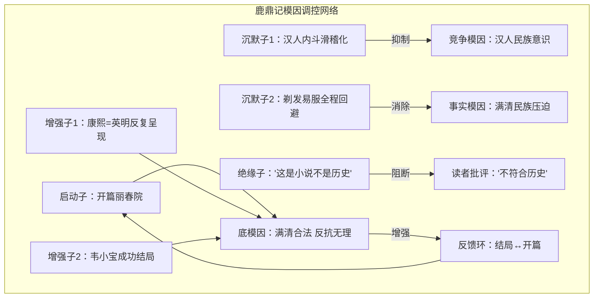

# 《鹿鼎记》模因图谱 —— 基于 3.0 产品结构的完整示例

> 版本：3.0
> 定位：首个完整五层模因图谱（案例验证）
> 数据来源：现有模因图谱分析 + 3.0 结构设计文档的示例
> 目的：验证五层产品结构的可行性和填充效率

---

## 元数据

```
作品名称：鹿鼎记
作者：金庸（查良镛）
创作年代：1969-1972 年连载于《明报》
作品类型：历史题材（明清交替背景的武侠小说）
分析者：范义民（基于天道理论框架）
分析日期：2026-05
分析覆盖度：核心（见末尾覆盖度自评表）
```

---

## L1：模因序列层（全量测序）

> **类比诚实性**：L1 使用"测序""碱基"等术语。模因的"碱基"不是化学实体而是分析者的判断结果。L1 拆为层 0（原始素材）+ 层 1（偏差标注），以弥补精确性的不足。

### 事实锚定底表

| 维度 | 作品叙事 | 事实 | 偏差类型 |
|------|---------|------|---------|
| 康熙 | 千古圣君、勤政爱民 | 康熙朝推行圈地运动、迁海令（沿海五十里内杀绝烧光）、大规模文字狱、满汉分治 | 美化 |
| 明朝 | 腐朽、昏庸、民不聊生，一无是处 | 明朝经济总量长期占全球 1/3 以上，晚明市民社会高度繁荣，科技航海文化领先全球，有郑和下西洋、四大名著三部成书、《本草纲目》《天工开物》等 | 抹黑 |
| 满清入关 | 合法的"逐鹿问鼎"，替明朝收拾烂摊子 | 异族侵略，推行扬州十日、嘉定三屠等全国性大屠杀，人口超千万，强制剃发易服 | 置换 |
| 反清复明 | 派系内斗、个人私利的瞎折腾 | 民族压迫下的正义反抗，承载汉族民族认同与反抗精神 | 抹黑 |
| 康乾盛世 | 太平盛世，民安居乐业 | 西方学者定义的"饥饿的盛世"，底层汉人普遍赤贫，人均粮食占有量仅为晚明 1/3 | 美化+回避 |

### 层 0 —— 原始素材清单

```
【层0 · 原始素材清单】

素材ID: SRC-001
类型: 设定
位置: 贯穿全书
内容: 康熙是英明圣君

素材ID: SRC-002
类型: 台词
位置: 第X回
内容: "反清复明就是抢回钱和女人"

素材ID: SRC-003
类型: 叙事选择
位置: 全书
内容: 韦小宝第一人称视角叙事

素材ID: SRC-004
类型: 设定
位置: 贯穿全书
内容: 韦小宝从底层鱼贩到鹿鼎公的成功轨迹

素材ID: SRC-005
类型: 设定
位置: 贯穿全书
内容: 明朝皇室/汉族正统势力昏庸无能，只会内斗

素材ID: SRC-006
类型: 设定
位置: 贯穿全书
内容: 天地会/汉族反抗者虚伪、愚蠢、徒劳

素材ID: SRC-007
类型: 台词
位置: 第X回
内容: "鸟生鱼汤"

素材ID: SRC-008
类型: 台词
位置: 第X回
内容: "平生不见陈近南，便称英雄也枉然"

素材ID: SRC-009
类型: 符号
位置: 贯穿全书
内容: 四十二章经（藏有满清龙脉宝藏地图）

素材ID: SRC-010
类型: 符号
位置: 结局
内容: 鹿鼎山 / 鹿鼎公封号

素材ID: SRC-011
类型: 叙事选择
位置: 全书
内容: 剃发易服全程不被提及，韦小宝从未因此产生心理波动

素材ID: SRC-012
类型: 叙事选择
位置: 开篇
内容: 从扬州丽春院开局

素材ID: SRC-013
类型: 设定
位置: 结局
内容: 陈近南死于自己效忠的汉族皇室之手

素材ID: SRC-014
类型: 设定
位置: 结局
内容: 韦小宝放弃权力，携家人归隐
```

### 层 1 —— 偏差标注

```
【层1 · 偏差标注】

标注ID: DEV-001
关联素材: SRC-001（设定：康熙圣君）
偏差类型: 美化
偏差方向: 将推行民族压迫的满清统治者呈现为仁德圣君
事实依据: 康熙朝圈地运动、迁海令、文字狱、满汉分治
置信度: [高] 事实锚定充分

标注ID: DEV-002
关联素材: SRC-002（台词：反清复明=抢钱抢女人）
偏差类型: 抹黑 + 置换
偏差方向: 将汉族反抗民族压迫的正义行为，抹黑为私利驱动；用"抢钱抢女人"置换"民族解放"
事实依据: 反清复明是民族压迫下的正义反抗
置信度: [高] 事实锚定充分

标注ID: DEV-003
关联素材: SRC-003（叙事选择：韦小宝视角）
偏差类型: 回避
偏差方向: 通过市井视角，系统性地不呈现满清民族压迫的核心事实
事实依据: 满清大屠杀、剃发易服、文字狱等核心事实在韦小宝视角下全数缺席
置信度: [中] 叙事选择的"回避意图"需要更多论证

标注ID: DEV-004
关联素材: SRC-004（设定：韦小宝成功轨迹）
偏差类型: 置换
偏差方向: 把"依附满清皇权"置换为"个人奋斗成功"，掩盖成功的结构性条件
事实依据: 韦小宝的每一步晋升都依赖康熙庇护，而非个人能力或市场逻辑
置信度: [高] 文本内部逻辑一致

标注ID: DEV-005
关联素材: SRC-005（设定：明朝腐朽）
偏差类型: 抹黑 + 回避
偏差方向: 只呈现明末局部乱象，完全回避明朝的文明成就
事实依据: 明朝经济总量全球 1/3、科技领先、文化繁荣等全数回避
置信度: [高] 事实锚定充分

标注ID: DEV-006
关联素材: SRC-006（设定：反抗者虚伪）
偏差类型: 抹黑
偏差方向: 将民族反抗者丑化为虚伪、愚蠢、内斗的乌合之众
事实依据: 历史上反清复明运动持续数十年，有组织、有牺牲、有传承
置信度: [高] 事实锚定充分

标注ID: DEV-007
关联素材: SRC-007（台词：鸟生鱼汤）
偏差类型: 美化
偏差方向: 通过高频重复的搞笑台词，将康熙与尧舜禹汤并列
事实依据: 康熙统治的实质是民族压迫，与尧舜禹汤的禅让仁政完全相反
置信度: [高] 对比鲜明

标注ID: DEV-008
关联素材: SRC-009（符号：四十二章经）
偏差类型: 置换
偏差方向: 把满清的龙脉宝藏定义为天下核心财富，把汉人江山写成满清的合法财产
事实依据: 满清通过侵略获得统治权，非"合法继承"
置信度: [中] 符号解读可能因分析者而异

标注ID: DEV-009
关联素材: SRC-011（叙事选择：回避剃发易服）
偏差类型: 回避
偏差方向: 刻意掩盖满清对汉人民族衣冠、文明认同的摧毁
事实依据: 剃发易服是满清最核心的民族压迫政策，"留头不留发，留发不留头"
置信度: [高] 历史事实清晰

标注ID: DEV-010
关联素材: SRC-012（叙事选择：开篇丽春院）
偏差类型: 抹黑
偏差方向: 把汉族的繁华之地扬州，写成藏污纳垢的市井泥潭，开篇矮化汉族文明高度
事实依据: 扬州在晚明是商业重镇、文化中心
置信度: [中] 文学开篇的"场景选择"是否算"抹黑"需要更多论证
```

---

## L2：模因结构层（染色体分组）

> **类比诚实性**：L2 使用"染色体""基因"等术语。模因的"染色体"是功能分类而非物理结构。不同作品有相同的染色体编号，但内容因作品而异。

### 着丝粒（底层根模因）

```
着丝粒：
"满清统治合法，汉族反抗无理，放弃民族立场才是生存正道"
```

### 染色体 1：身份定位（CHR-01）

**功能**：定义"你是谁"——作品中谁好、谁坏、谁值得同情、谁该被鄙视。

| 基因（模因簇） | 包含的碱基（作品具体内容） | 功能 |
|---------------|--------------------------|------|
| 主角身份基因 | 韦小宝=放弃民族立场才能成功的市井小民 | 提供受众的代入入口 |
| 反派身份基因 | 明朝≠反派，但被矮化为"不值得同情的失败者" | 定义"什么是被鄙视的" |
| 正面角色基因 | 康熙=完美的、值得效忠的统治者 | 定义"什么是值得尊敬的" |
| 牺牲者基因 | 陈近南=悲壮的、但徒劳的牺牲 | 合理化"反抗=悲剧"的结论 |

**端粒（防御逻辑）**："我只是在写一个真实的人"（反讽/消解严肃的防御）

### 染色体 2：行动指令（CHR-02）

**功能**：定义"你应该做什么"——作品中什么行为被奖励、什么行为被惩罚。

| 基因（模因簇） | 包含的碱基（作品具体内容） | 功能 |
|---------------|--------------------------|------|
| 奖励行为基因 | 依附权力、灵活变通、放弃立场 | 定义"正确的行为" |
| 惩罚行为基因 | 坚持理想、民族反抗、道德坚守 | 定义"错误的行为" |
| 被忽略行为基因 | 满清的剥削统治不做后果呈现 | 遮蔽结构性因素 |

**端粒（防御逻辑）**："历史就是这样运行的"（决定论防御）

### 染色体 3：价值判断（CHR-03）

**功能**：定义"什么是对的/错的"——作品构建的道德坐标系。

| 基因（模因簇） | 包含的碱基（作品具体内容） | 功能 |
|---------------|--------------------------|------|
| 道德评价基因 | 康熙=仁德（vs. 真实历史的大屠杀） | 定义作品的道德框架 |
| 历史评价基因 | 清=正统，明=腐朽，反抗=愚蠢 | 扭曲历史真相 |
| 审美评价基因 | 韦小宝的市井狡黠被赋予"生命力"的美学 | 定义受众的审美方向 |

**端粒（防御逻辑）**："这是文学，不是历史"（文学豁免权防御）

### 染色体 4：情感锚定（CHR-04）

**功能**：定义"你该有什么感觉"——作品设计的情感触发点和情感导向。

| 基因（模因簇） | 包含的碱基（作品具体内容） | 功能 |
|---------------|--------------------------|------|
| 恐惧触发基因 | 民族立场带来的悲剧（陈近南的结局） | 制造对"坚持民族立场"的恐惧 |
| 希望触发基因 | 依附权力带来的成功（韦小宝的结局） | 提供"放弃立场=成功"的方向 |
| 愤怒导向基因 | 明朝的内斗、汉人的不团结 | 把愤怒引向被压迫民族自身 |
| 同情分配基因 | 康熙的"圣君之苦"、韦小宝的"夹缝困境" | 把同情分配给压迫者而非被压迫者 |

**端粒（防御逻辑）**："读者喜欢看这样的故事"（市场逻辑防御）

### 染色体 5：世界观地基（CHR-05）

**功能**：定义"世界是怎么运作的"——作品的底层宇宙观、社会观、人性观。

| 基因（模因簇） | 包含的碱基（作品具体内容） | 功能 |
|---------------|--------------------------|------|
| 人性本质基因 | 人皆自私（韦小宝=真实，英雄=虚伪） | 定义对人性的基本预设 |
| 社会运作基因 | 依附权力者生存，坚守原则者灭亡 | 定义对社会的底层理解 |
| 历史规律基因 | 历史没有方向，个人选择只关乎个人成败 | 定义对历史的底层理解 |

**端粒（防御逻辑）**："人性本来就是自私的"（普遍性防御）

### L2 染色体间交互摘要

```
CHR-01 与 CHR-03 的交互：身份定位（谁好谁坏）直接支撑价值判断（什么是正义的）。康熙被定位为"圣君"，因此满清统治被判定为正义的。
CHR-02 与 CHR-05 的交互：行动指令（依附权力）以世界观地基（人皆自私）为正当性基础。"人本来就是自私的，所以放弃立场是合理的"。
CHR-04 与 CHR-01 的交互：情感锚定（同情康熙）强化身份定位（康熙=值得尊敬的），两者互为正反馈。
```

---

## L3：模因功能层（基因功能注释）

> **类比诚实性**：L3 使用"基因""注释"等术语。模因的功能注释基于分析者的理论推演，每个注释必须附带置信度标记。

### 标准化注释表

```
基因ID：CHR-01.G-001
基因名称：韦小宝=放弃立场的成功者
染色体定位：CHR-01（身份定位）
功能类型：核心编码基因
──────────────────────────────────────
① 植入对象：
  华语汉族受众，尤其是有阶层焦虑的男性读者
──────────────────────────────────────
② 植入路径：
  第一层（情绪锚点）：爽文的快感——底层逆袭
  第二层（身份认同）：读者代入韦小宝="我也可以这样成功"
  第三层（意义赋予）：放弃立场不是软弱，是生存智慧
──────────────────────────────────────
③ 运作机制：
  通过"反英雄"叙事伪装——说韦小宝不是传统英雄→让读者接受"非英雄"的道德豁免
  → 最终结论：不坚守立场才能成功
──────────────────────────────────────
④ 表达条件：
  激活：读者代入韦小宝视角时自动激活
  抑制：当读者意识到"韦小宝的成功依赖康熙的庇护"时暂时退却
──────────────────────────────────────
⑤ 交互关系：
  共生：CHR-02.G-001（奖励依附行为）
  拮抗：历史事实（真实历史上依附满清的汉人结局）
  被调控：CHR-05.G-002（"历史是成王败寇"——为依附行为提供正当性）
──────────────────────────────────────
注释置信度：[高] 事实锚定充分，多维度交叉验证一致
```

```
基因ID：CHR-04.G-001
基因名称：同情分配基因——同情分配给压迫者
染色体定位：CHR-04（情感锚定）
功能类型：核心编码基因
──────────────────────────────────────
① 植入对象：
  同 CHR-01.G-001，华语汉族受众
──────────────────────────────────────
② 植入路径：
  第一层（情绪锚点）：康熙的孤独、责任重大让人心疼
  第二层（身份认同）：读者被引导到"从统治者的角度看问题"
  第三层（意义赋予）：统治也是苦差事，不要只看到权力
──────────────────────────────────────
③ 运作机制：
  通过"圣君之苦"的叙事框架——反复呈现康熙的勤政、孤独、责任
  → 让读者为压迫者感到心疼 → 消解被压迫者的愤怒
──────────────────────────────────────
④ 表达条件：
  激活：描写康熙深夜批奏折、无人理解的场景时
  抑制：读者意识到康熙拥有绝对权力和特权时，同情可能减弱
──────────────────────────────────────
⑤ 交互关系：
  共生：CHR-01.G-002（康熙=圣君身份基因）
  拮抗：历史事实（被压迫者的真实苦难）
  调控：CHR-04.G-003（恐惧触发——坚持民族立场=悲剧）
──────────────────────────────────────
注释置信度：[高] 叙事分析清晰
```

```
基因ID：CHR-02.G-001
基因名称：依附权力=生存的奖励机制
染色体定位：CHR-02（行动指令）
功能类型：核心编码基因
──────────────────────────────────────
① 植入对象：
  同 CHR-01.G-001
──────────────────────────────────────
② 植入路径：
  通过韦小宝的成长弧直接展示——每一次依附皇权就晋升一次
  反面案例：陈近南坚持原则=死亡
──────────────────────────────────────
③ 运作机制：
  行为+结果的重复配对——"听康熙的话→升官发财；坚持反清复明→悲惨结局"
  → 受众形成条件反射式的行为认知
──────────────────────────────────────
④ 表达条件：
  激活：读到韦小宝因康熙赏识而晋升的段落
  抑制：读者意识到韦小宝的"成功"本质是奴才的成功
──────────────────────────────────────
⑤ 交互关系：
  共生：CHR-05.G-001（人皆自私）
  拮抗：民族意识（如果读者有强烈的民族立场）
──────────────────────────────────────
注释置信度：[高] 文本内证据充分
```

```
基因ID：CHR-05.G-001
基因名称：人性本质=自私
染色体定位：CHR-05（世界观地基）
功能类型：核心编码基因 + 伪装基因
──────────────────────────────────────
① 植入对象：
  所有读者（这是世界观层面的预设）
──────────────────────────────────────
② 植入路径：
  不是通过说教，而是通过韦小宝的内心独白和叙事视角自然渗透
  韦小宝从不掩饰自己的自私，反而因此显得"真诚"
──────────────────────────────────────
③ 运作机制：
  "真诚的自私"叙事——韦小宝不像传统英雄那样装模作样，他直接承认自己要钱要权
  → 读者接受"人本来就是自私的"→ 进而接受"放弃民族立场是合理的"
──────────────────────────────────────
④ 表达条件：
  激活：全篇持续激活（韦小宝的每一次内心活动都在强化这个预设）
  抑制：遇到坚守原则的角色（陈近南）时短暂退却，但陈近南的悲剧结局反而强化了自私合理性
──────────────────────────────────────
⑤ 交互关系：
  共生：所有其他基因（为放弃立场、依附权力、同情压迫者提供底层正当性）
  拮抗：集体主义叙事、民族主义叙事
──────────────────────────────────────
注释置信度：[高] 预设分析清晰
```

### 基因功能总览

| 基因 ID | 基因名称 | 染色体 | 功能类型 | 置信度 |
|---------|---------|--------|---------|--------|
| CHR-01.G-001 | 韦小宝=放弃立场的成功者 | CHR-01 | 核心编码基因 | 高 |
| CHR-01.G-002 | 康熙=圣君 | CHR-01 | 核心编码基因 | 高 |
| CHR-01.G-003 | 反抗者=虚伪内斗 | CHR-01 | 核心编码基因 | 高 |
| CHR-02.G-001 | 依附权力=生存奖励 | CHR-02 | 核心编码基因 | 高 |
| CHR-03.G-001 | 满清正统=历史正义 | CHR-03 | 核心编码基因 | 高 |
| CHR-03.G-002 | 文学豁免权 | CHR-03 | 防御基因 | 高 |
| CHR-04.G-001 | 同情分配给压迫者 | CHR-04 | 核心编码基因 | 高 |
| CHR-04.G-002 | 恐惧坚持立场=悲剧 | CHR-04 | 增强基因 | 高 |
| CHR-05.G-001 | 人性本质=自私 | CHR-05 | 核心编码基因+伪装 | 高 |
| CHR-05.G-002 | 历史=成王败寇 | CHR-05 | 核心编码基因 | 中 |

---

## L4：模因调控层（表达调控网络）

> **类比诚实性**：L4 使用"启动子""增强子"等调控元件术语。生物学的调控元件有明确的 DNA 序列特征和实验验证方法，模因的调控元件基于叙事策略的归类分析。

### 调控元件识别

| 调控元件 | 作品中的表现 | 识别的叙事特征 |
|---------|------------|---------------|
| **启动子**（开启模因表达） | 开篇置于扬州丽春院 | 激活"汉族文明堕落"的初始印象，为后续满清统治的"秩序"做铺垫 |
| **增强子**（增强表达效果） | 康熙英明决策反复出现；韦小宝成功结局 | 高频强化"好皇帝"认知；用"好人有好报"的结构印证依附行为的正确 |
| **沉默子**（抑制竞争模因） | 汉人内斗滑稽化；剃发易服全程回避 | 用搞笑消解抗议的严肃性；完全不呈现民族压迫的核心事实 |
| **绝缘子**（防止模因溢出） | "这是小说不是历史" | 预先阻断"不符合历史"的批评 |
| **反馈环**（自我强化闭环） | 结局↔开篇 | 韦小宝从丽春院开始到归隐结束——"不反抗才能活到最后"反复强化 |

### 三层表达调控

**第一级：叙事调控**（作品内部）

| 调控方式 | 作品中的具体表现 |
|---------|----------------|
| 剂量控制 | 康熙英明决策反复出现（高频），满清大屠杀全程不出现（剂量为零） |
| 时序控制 | 开篇扬州丽春院（激活"汉族文明堕落"初始印象）；先呈现汉人内斗再呈现满清秩序（对比强化） |
| 框架控制 | 全程韦小宝市井视角（框架决定读者立场——看不到结构，只看得到个人得失） |
| 类比控制 | "反清复明就是抢回钱和女人"（暗示反抗者动机不纯）；"鸟生鱼汤"（暗示康熙=尧舜禹汤） |

**第二级：受众调控**（读者认知状态）

| 受众状态 | 在本作品中的预期表达效果 |
|---------|------------------------|
| 顺向阅读（无预设） | 模因最容易被完整接收——笑着看完，世界观已被重塑 |
| 批判阅读（有准备） | 模因表达被部分抑制——但仍可能被"反英雄"伪装所迷惑 |
| 重复阅读（多次接触） | 模因被内化为"自然认知"——尤其是经影视剧改编后，"康熙=圣君"几乎成为文化默认值 |
| 对抗阅读（有立场） | 模因表达被大部分抑制，但可能触发"反向强化"——越读越气，反而坚定了民族立场 |

**第三级：文化调控**（社会语境）

| 社会语境 | 对作品模因的预期影响 |
|---------|--------------------|
| 民族意识高涨期 | 模因被削弱——读者开始质疑"为什么要把康熙写得这么好" |
| 个人主义时期 | 模因增强——"放弃立场=个人自由"的解读占据主流 |
| 意识形态强化期 | 模因被体制强化——满清正统叙事符合"多民族统一国家"的官方叙事需要 |
| 历史重构期 | 模因可能被重新激活——用于当代目的（如文化自信讨论中的清朝评价） |

### 调控网络图



---

## L5：模因演化层（跨作品比较）

> **类比诚实性**：L5 使用"同源""趋同""演化树"等术语。生物学的同源判定有分子钟和序列比对工具，模因的同源判定只能依赖偏差特征比对和文化谱系追溯。

### 演化定位类型判断

```
同源/趋同判定（依据四步判定流程）：
目标：鹿鼎记的核心模因 M1（"满清统治合法，汉族反抗无理"）与清宫剧模因 M2（"满清宫廷=精致文化，汉人身份=无关"）的关系

步骤1 — 偏差特征比对：
  M1偏差类型：美化（满清）+ 抹黑（汉明）+ 回避（民族压迫）
  M2偏差类型：美化（满清宫廷）+ 回避（民族压迫）
  → 偏差特征部分一致，但M2去除了"抹黑"成分，增加了"审美化"成分
  → 不完全匹配，进入步骤2

步骤2 — 文化谱系追溯：
  M1→M2有明显的传播链：鹿鼎记（清中期文本）→ 民国清宫剧 → 当代清宫剧
  M2的作者显然接触过M1谱系的模因
  → 有可追溯的传播链 → 倾向同源（即使偏差特征有变异）

判定输出：[同源] — 两者是同一祖先模因在不同时代的变异体
置信度：[高] 文化谱系可追溯
```

### 演化分析：同源模因分析

| 维度 | 说明 |
|------|------|
| 祖先模因 | "异族统治=合法，被统治者=服从" |
| 保留特征 | 核心不变：消解汉民族主体性，接受多民族帝国叙事 |
| 变异特征 | 外壳从"政治合法性"演变为"审美偏好"——从直白美化满清皇帝转为精致化宫廷文化 |
| 适应环境 | 从清中期的殖民合法性需要 → 民国至当代的多民族国家叙事 → 消费主义时代的文化审美商品化 |

**演化表**：

| 时代 | 作品谱系 | 模因形态 | 变异方向 |
|------|---------|---------|---------|
| 清中期 | 《鹿鼎记》 | 满清=圣君，汉明=腐朽 | 原始形态：为殖民统治提供合法性 |
| 民国 | 《清宫秘史》等 | 满清=浪漫宫廷，汉人=配角 | 延续形态：民族叙事被置换为宫廷叙事 |
| 当代 | 清宫剧（《甄嬛传》等） | 满清=精致文化，汉人身份=无关 | 变异形态：民族压迫被置换为"文化审美" |
| 当代 | 网络"明粉/清粉"话语 | 明/清之争=个人品味问题 | 退化形态：严肃历史被简化为饭圈选择 |

**规律发现**：模因的核心（消解汉民族主体性）不变，但外壳从"政治合法性"演变为"审美偏好"，变得更难识别。

### 演化谱系定位

```
            祖先模因："异族统治=合法，被统治者=服从"
                       │
                ┌──────┴──────┐
                │             │
             政治合法性     文化优越性
             （清中期）     （民国—当代）
                │             │
             ┌──┴──┐      ┌──┴──┐
             │     │      │     │
           鹿鼎记 清宫剧 宫廷审美 民族虚无
            (直白) (置换) (精致化) (饭圈化)
                ↑
             本作品
```

---

## 终极判定

### 面向普通用户的判定

```
问题一：这部作品站在哪一边？
→ 掠夺性天道。它帮人保持麻木，不是帮人看清真相。
  一句话理由：它用爽文的外壳，把满清的民族压迫合法化，把汉族的反抗丑化，让读者笑着接受了
  "放弃民族立场才是生存正道"的驯化。

问题二：它的传播服务于谁？
→ 受益者：满清统治的辩护者、任何希望消解汉民族主体性的力量。
  受损者：汉族受众的民族认同和历史认知。
  一句话理由：几代人通过这部作品形成了"康熙=圣君、明朝=腐朽、反抗=愚蠢"的错误历史认知，
  这种认知至今仍在大众文化中流通。

问题三：如果看穿了它，该怎么做？
→ 防御：阅读时保持"历史对照思维"——每看到一个历史判断，先问"真实历史上是这样的吗？"
  利用：提取其高超的叙事技巧（人物塑造、视角选择、情感节奏）用于写作，但剥离其历史偏见。
  传播：可以作为"模因分析教学案例"推荐，但必须附带分析说明，不建议作为"好小说"盲目推荐。
```

### 理论推导说明（可选）

```
a) 天道属性定位：
   - [掠夺性天道]
   - 判定依据：服务于富集层（满清统治阶级）对生产层（汉族被统治群体）的叙事驯化

b) 社会营养级定位：
   - 服务对象：富集层（满清皇权及其继承者的叙事合法性）
   - 表面上服务：生产层读者的娱乐需求（爽文快感）
   - 实际上服务：维持征服者叙事对被征服者群体的文化统治

c) 驯化强度判定：
   - [强驯化]
   - 判定依据：
     事实处理：系统性扭曲明清历史
     人物塑造：康熙=完美，反抗者=小丑，对比极端不均衡
     台词效果："鸟生鱼汤""反清复明=抢钱抢女人"等台词具有强复制性
     反抗意识：全方位消解
     利益服务：完美服务于"放弃民族立场"的终极结论
```

---

## 质量控制

### 覆盖度自评

```
【覆盖度自评】

L1覆盖度：
  层0素材类型覆盖：设定[核心] / 台词[核心] / 叙事选择[部分] / 符号[部分]
  层0素材数量：N=14
  层1偏差标注数量：N=10
  未覆盖区域说明：后40回的台词未做系统抽取，符号（四十二章经、鹿鼎山）仅覆盖核心两个

L2覆盖度：
  CHR-01（身份定位）：[完整]
  CHR-02（行动指令）：[完整]
  CHR-03（价值判断）：[完整]
  CHR-04（情感锚定）：[完整]
  CHR-05（世界观地基）：[完整]
  着丝粒识别：[已识别]

L3覆盖度：
  功能注释完成的基因数量：N=5
  未注释的基因数量：N=5（仅列出了ID，未做完整注释）
  备注：CHR-01.G-002 至 CHR-05.G-002 中，选取了最具代表性的5个做了完整注释

L4覆盖度：
  调控网络：[已绘制]
  三层调控分析：[完整]

L5覆盖度：
  跨作品比较：[部分]（仅做了同源分析，未做趋同、嵌合体、漂变分析）
  同源判定数量：N=1
  趋同判定数量：N=0

总体覆盖度等级：[核心]
```

### 反事实测试

```
【反事实测试】

主结论：鹿鼎记是一套掠夺性天道的强驯化模因体系

挑战一：最有力的反证
  反证描述：鹿鼎记也讽刺了满清官场的腐败（如索额图、明珠等贪官），并非一味美化。小说中韦小宝
  的贪污受贿、官场潜规则等描写，也在"揭露"满清体制的黑暗面。能否据此认为它有"启蒙"成分？
  反证来源：SRC-追加（满清官场腐败描写——本分析未系统收录）
  对主结论的影响：[部分弱化]
  回应：揭露官场腐败不等于挑战满清统治合法性。小说批判的是具体的贪官（个人腐败），而非满清
  的统治结构（系统压迫）。这种"批判但不触及结构"的手法，反而增强了驯化的有效性——让读者觉得
  "这部小说很真实、很有批判性"，从而更不容易察觉它对满清统治合法性的全盘接受。

挑战二：替代解释
  替代解释描述：鹿鼎记的本质是一部"反武侠"的文学实验，它的核心目的是解构传统武侠的英雄神话，
  而非刻意美化满清。历史偏见是时代的局限（金庸作为香港文人在殖民语境下写作），而非蓄意驯化。
  与本分析的解释力比较：[更差]
  ——反武侠只是表层手法（"伪装基因"），底层叙事选择（全程回避剃发易服、系统美化康熙、丑化
  反抗者）无法用"文学实验"解释。时代语境只能解释部分偏差，不能解释偏差的方向一致性。

挑战三：分析者的立场标注
  分析者和作品之间的利益/情感关系：无直接利益关系。阅读鹿鼎记是青少年时期，当时未产生批判意识。
  分析者在受众中的群体归属：汉族，受鹿鼎记+清宫剧模因长期影响过的受众。
  可能的偏见方向：矫正过正——在"看穿驯化"后可能过度强调其驯化意图，低估其作为文学作品
  本身的复杂性（如人物塑造的文学成就）。
```

---

*本图谱基于《文学作品模因图谱 3.0 —— 基于人类基因组图谱类比的结构设计》的模板填写。*
*验证结论：五层产品结构可行，鹿鼎记的现有数据可以自然填入模板。L1 的完整性（14个素材+10个偏差标注）足够支撑后续 L2-L5 的分析。覆盖度自评+反事实测试未增加显著负担。*
