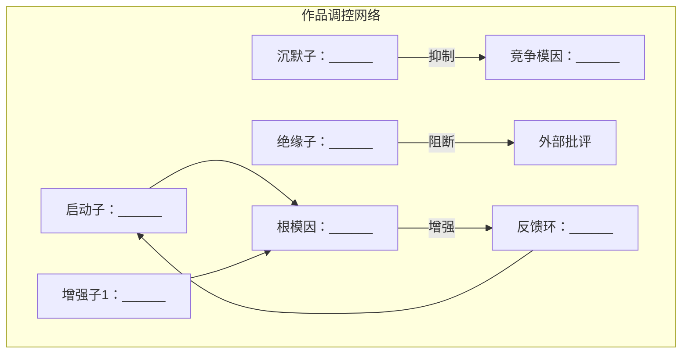

# 作品立场分析 · 模因图谱 v6.1

> 本框架采用五层分析（L1-L5）+ 四维交叉验证 + 反事实测试 + 终极判定。
> 核心设计目标：**即使执行者没有批判性思维天赋，严格按流程走也能产出深度分析。**
> 实现方式：所有深度机制都编码为**硬性规则**而非建议。不满足自检条件则滑梯退出。

---

## 执行总则（硬性）

1. **事实优先**：所有分析必须先锚定真实事实。不能顺着作品叙事做无对照分析。
2. **置信度强制**：每个判断必须附带置信度。置信度规则由字段内容自动决定，不是自由选择（见L1置信度锚定规则）。
3. **对称性强制**（新）：任何"激活条件"必须同时写"抑制条件"，任何"共生关系"必须同时写"拮抗关系"。只写一半=字段未完成=自检不通过。
4. **反事实强制**（新）：分析结论必须经过"攻击自己"的步骤（见反事实测试章节）。未完成反事实测试=分析无效。
5. **自检关卡不可跳过**：每个阶段末尾的自检关卡必须逐项打勾通过。任何一项不通过→滑梯退出并输出原因。

---

## 阶段一：检索校准

### 1.1 作品类型识别

从以下类型中选择：

```
A. 历史题材——涉及真实历史人物/事件/朝代
B. 现实主义题材——以当代/近代现实社会为背景
C. 纯虚构世界观——完全虚构的世界
D. 寓言/改编作品——有明确原著的改编，或自觉使用寓言/象征/隐喻手法的创作
E. 功能文本——说明书/教程/规章/宣传材料/政论/战略论述
F. 混合型
G. 纯美学文本——不以传递世界观为目的，无叙事结构，无人物塑造，无社会关系描写

**F类·混合型处理规则（v6.1新增）**：

混合型作品（如"历史题材+言情虚构"）需同时满足以下条件：
1. 判定为F类后，必须声明"以______为主、______为辅"的主次关系
2. 偏差标注以主类型为标准，辅类型为补充
3. 事实锚定底表：主类型字段完整，辅类型字段可简写
4. 素材数量门槛：按主类型的标准
5. D类寓言声明：如果混合型中包含D类特征，同样需要输出D类声明（放在主类型声明之后）

**F类判定示例**：
- 《还珠格格》：A类（历史题材）为主、D类（寓言改编）为辅——使用真实历史人物，核心情节为言情虚构
- 《大话西游》：D类为主、C类为辅——有明确原著改编，但世界观自成体系
```

**D类判定标准**（符合任意一条即归为D类）：
- 有明确原著且进行了系统性改编
- 核心手法是寓言/象征/隐喻
- 存在自觉信号"这不是在说这个，是在说那个"

**G类自动触发条件**（同时满足以下三条）：
- 字数 < 2000
- 无人物、无情节、无对话
- 纯景物/情感描写

**G类处理**：输出"本作品不适合模因图谱分析"，直接结束。

### 1.2 分类型检索

优先依靠训练数据中的知识。仅在以下情况使用外部检索：
- 对关键事实不确定（日期、数据、事件经过）
- 需要验证训练数据中的记忆是否准确
- 分析者意识到自己对该作品/题材存在知识盲区

**A类·历史题材**——对照真实历史：
- 核心历史事件的真实经过
- 核心历史人物的正史评价
- 该时期的宏观数据
- 作者的创作历史语境

**B类·现实主义**——对照社会现实：
- 作品涉及的社会矛盾的真实数据
- 行业的真实运作逻辑
- 作者身份和公开立场

**C类·纯虚构**——转向框架锚定：
- 世界观的逻辑自洽性
- 权力结构映射的现实关系
- 继承/挑战了哪些叙事传统

**D类·寓言/改编**——转向意图分析：
- 原著的原始模因
- 改编者的立场和意图
- 象征系统对应的现实指涉

**E类·功能文本**——对照论点正确性：
- 核心论点是否与事实一致
- 引用数据是否准确
- 作者的立场和动机

### 1.2a 检索执行规则（v6.1新增）

检索不是分析的必经之路，而是有明确触发条件的辅助手段。按以下规则执行：

```
规则一：发起外部检索前，先判断"当前事实是否已有足够把握"
  - 有把握（置信度≥中）→ 跳过检索，在"检索执行"中注明"未使用外部检索：训练数据覆盖充分"
  - 无把握（置信度<中）→ 发起外部检索

规则二：外部检索最多执行【1次】
  - 1次检索请求（WebSearch），指定最核心的搜索词
  - 如果1次检索无返回/超时→直接进入分析，不重试
  - 在"检索执行"中注明"外部检索无返回，基于训练数据继续"

规则三：外部检索获知的新信息必须做来源标注
  - 训练数据中的知识→不标注
  - 外部检索获知的信息→在对应事实旁标注"[外部检索]"
  - 便于用户区分"分析者原本知道什么"和"检索补充了什么"
```

**检索执行记录（v6.1强制）**：

检索完成后，须在事实锚定底表之前输出以下记录：

```
信息来源：______（训练数据/外部检索补充/两者并用）
检索尝试：
  - [每次检索的搜索词及结果]
  - ...
检索结果：______（成功/全部失败/部分成功）
检索摘要：______
知识完整度：______
  - 充足维度：
  - 不足维度：
  - 风险：
```

> 该记录的目的是让用户看到"分析者用了什么信息源"，而非假设分析者无所不知。检索全部失败时，必须在知识完整度中标注"风险"，并在后续分析中将所有"可验证"证据降级为"中"置信度（因来源仅为训练数据）。

### 1.2b 推测性结论强制标记规则（v6.1新增）

分析中所有超出事实判断的范围、依赖分析者个人推演的结论，必须显式标记。未标记的推测性结论→自检不通过。

| 判断类型 | 定义 | 标记要求 |
|---------|------|---------|
| **事实判断** | "作品说X，但事实是Y"——基于可验证事实 | 不标注 |
| **合理推断** | "基于事实X，作品的效果可能是Y"——有逻辑链条 | 标注`[推断]` |
| **推测** | "作品的深层动机是Z"——无直接证据 | 标注`[推测]` |
| **可疑推测** | 涉及对作者/机构动机的归因（如"作者有意X"、"服务于Y的隐性目的"） | 标注`[推测·敏感]` |

**可疑推测的定义**：当分析者对作者、审查机构、政治力量的动机做归因时（"作者有意配合宣传需要"、"服务于官方的X目的"、"起到Y的政治功能"），无论推断看起来多合理，都必须标记为`[推测·敏感]`。这类归因**无法从作品文本本身得到验证**，属于分析者的外部解读。不标注→自检不通过。

> 理由：动机归因是将分析从"作品说了什么"跨越到"为什么作者/体制要这么说"的跳跃。这个跳跃可能是合理的，但必须让读者知道这一步是推测，不是事实。
```

### 1.3 事实锚定底表

**A/B/C/F类**：

```
| 维度 | 作品叙事 | 真实事实 | 偏差类型 |
|------|---------|---------|---------|
| 事件/人物 | 作品说…… | 实际上是…… | 美化/抹黑/回避/置换 |
```

**同时收录正向素材**：

```
| 正向素材 | 作品呈现 | 事实核对 | 类型 |
|---------|---------|---------|------|
| 事件/人物 | 作品说…… | 确实如此…… | 正确呈现/启蒙洞察 |
```

**D类**使用替代框架（符号/角色→现实指涉，叙事选择→改编意图，立场传递）。
**E类**使用替代框架（论点正确性、修辞策略、选择性呈现、框架预设）。

**D类输出前强制声明**：

```
D类寓言声明：本作品核心手法是寓言/象征/改编，不适用标准事实偏差标注。
以下分析不将"与事实不符"视为偏差，而是分析符号系统的指向和改编选择的意图。
```

输出格式：

```
信息来源：______（训练数据/外部检索补充/两者并用）
检索执行：______
知识完整度：______
```

### ⏏ 自检关卡1

```
□ 事实锚定底表已完整填写（偏差素材和正向素材均已收录）
□ 作品类型已明确判定
  - F类（混合型）→ 已声明主次关系
  - 含D类特征 → 已输出D类寓言声明
□ 检索执行记录已完成（包括检索词、结果、知识完整度、风险标注）
□ 偏差素材覆盖了DIM-01到DIM-05的至少4个维度
□ 正向素材至少收录了最低数量
```

**未通过则滑梯退出**：输出"素材不足——本分析因【具体原因】不达标而终止"，结束。

---

## 阶段二：作品分析（五层）

### 2.0 素材层（L1）

#### 层0——原始素材清单

收录可精确定位的最小内容单元。只登记，不评价。

**精度标准（硬性）**：

| 作品类型 | 位置精度最低要求 |
|---------|----------------|
| 电影 | 标注到"第X分钟/第X幕" |
| 电视剧/长篇小说 | 标注到"第X集/第X回" |
| 短篇小说/散文 | 标注到"开头/中间/结尾" |
| 功能文本 | 标注到"第X章/第X节" |

**位置写"全剧贯穿""全文贯穿"只允许用于以下情况**：该素材确实在作品从头到尾的每个部分都以相同形式反复出现。如果能指出具体出现在哪些位置，则必须写出具体位置。不能指出的，需要在"内容"栏中写清楚"无法定位到具体段落，但这是作品的核心设定"。

```
素材ID: SRC-001
类型: [台词/设定/叙事选择/符号]
位置: [按精度标准要求标注]
内容: [原文或精确描述]

素材间关系（如适用）：
关联素材: [SRC-XXX]
关系类型: [支撑/矛盾/补充]
说明: [该素材如何支撑/矛盾/补充另一素材]
```

```
正向素材ID: POS-001
类型: [台词/设定/叙事选择/符号]
位置: [按精度标准要求标注]
内容: [原文或精确描述]
正向类型: [正确呈现/启蒙洞察]
```

**素材数量门槛**——硬性规则。低于门槛则滑梯退出：

| 类型 | 偏差最低 | 正向最低 | 合计最低 |
|------|---------|---------|---------|
| A类·历史 | 8 | 3 | 11 |
| B类·现实主义 | 8 | 3 | 11 |
| C类·纯虚构 | 6 | 3 | 9 |
| D类·寓言/改编 | 6 | 2 | 8 |
| E类·功能文本 | 8 | 3 | 11 |

**素材间关系（硬性——v6.0新增）**：

层0收录的素材之间如果存在支撑/矛盾/补充关系，必须在每个素材的"素材间关系"字段中标注。至少标注以下两类关系中的各一条：

| 关系类型 | 要求 | 示例 |
|---------|------|------|
| **支撑关系** | 至少标注1条 | DEV-001（康熙圣君）是DEV-003（韦小宝视角回避剃发易服）的前提条件 |
| **拮抗关系** | 至少标注1条 | POS-001（如实呈现的史实）与DEV-002（抹黑明朝）构成矛盾 |

**不标注素材间关系→L1判定为未完成→滑梯退出。**

#### 层1——标注

对照事实锚定底表，标注偏差：

| 类型 | 定义 |
|------|------|
| 美化 | 将负面事实呈现为中性或正面 |
| 抹黑 | 将中性或正面事实呈现为负面 |
| 回避 | 对关键事实完全不提及 |
| 置换 | 用一个伪命题替代真实命题 |
| 正确呈现 | 与事实一致 |
| 启蒙洞察 | 揭示了被掩盖的结构性真相 |

```
标注ID: DEV-001
素材: SRC-001
类型: [美化/抹黑/回避/置换/正确呈现/启蒙洞察]
方向: [具体描述]
依据: [事实引用]
置信度: [高/中/低]

拮抗标注（硬性）：
拮抗素材: [标注ID]
拮抗方向: [本标注与拮抗素材的结论方向一致/相反]
说明: [如果相反，什么条件会触发拮抗效果？如果一致，为什么还需要两条标注？]
```

**置信度锚定规则**：

| 置信度 | 条件 |
|-------|------|
| 高 | 依据栏填写了具体事实引用，且可直接验证 |
| 中 | 依据栏填写了推理过程但无直接事实引用 |
| 低 | 依据栏为空或填写了主观判断 |

- 依据为空的标注→不纳入L2素材引用计数
- 持续出现低置信度标注→自动触发素材不足滑梯退出

**拮抗标注规则（v6.0新增——硬性）**：

**每条标注（DEV/POS）都必须标注其与至少一条其他标注的拮抗关系。**

- 如果不存在拮抗关系（即所有标注的结论方向完全一致），则必须在拮抗说明中注明："本作品所有标注方向一致，无内部拮抗——这本身是一个关键特征，说明作品在素材层面的处理是单向度的"
- 不标注拮抗关系→L1判定为未完成→滑梯退出

**理由**：这个规则强制分析者思考"作品内部的冲突和矛盾"，而不是单向度地"找证据证明结论"。如果分析者发现所有素材都指向同一方向——那这个发现本身就有分析价值（作品在素材层面就是单向度的）。

**素材比例量化**（层1完成后输出）：

```
【素材比例量化】
偏差素材总数：__  正向素材总数：__  合计：__
偏差类型分布：美化__ / 抹黑__ / 回避__ / 置换__
正向类型分布：正确呈现__ / 启蒙洞察__
偏差vs正向比例：__:__
→ 偏差主导（偏差≥70%）/ 正向主导（正向≥70%）/ 相对均衡（偏差40-60%）

【拮抗关系统计】
已标注拮抗关系数：__
标注间方向一致性：完全一致（无内部拮抗）/ 存在内部拮抗
```

---

### 2.1 结构层（L2）

**核心任务**：将携带偏差和正向的素材按功能聚类为五个分析维度。

**底层根模因**——必须通过三重验证：

| 标准 | 定义 |
|------|------|
| 跨维度复现 | 根模因必须在至少3个维度中有体现 |
| 有生成力 | 必须能推断作品对未直接呈现场景的叙事倾向 |
| 有排他性 | 不是同类作品的共性特征 |

```
底层根模因：[一句话]
三重验证通过情况：
  ✅/❌ 跨维度复现——在DIM-[XX]/[XX]/[XX]中体现
  ✅/❌ 有生成力——可推断作品对[场景]的叙事倾向
  ✅/❌ 有排他性——本作品特有，非类型共性
判定：通过/降级为常见主题
```

**维度一：身份定位（DIM-01）**——定义谁好谁坏

| 模因策略 | 对应素材 |
|---------|---------|
| 主角身份策略 | [素材ID] |
| 反派身份策略 | [素材ID] |
| 正面角色策略 | [素材ID] |
| 牺牲者策略 | [素材ID] |

**自我保护机制**（v6.0强制）：
> 填写"如果被质疑，作品的辩护话术是什么"（如"我只是在写一个真实的人"、"这是文学不是历史"）
> 必须写出具体的话术——至少识别一种自我保护机制。识别不出的，写"默认防御：作品以娱乐性/虚构性逃避质疑"并标注为推测。

**维度间关系**（v6.0新增——强制）： 

| 本维度策略 | 关联维度 | 关联策略 | 关系类型 | 说明 |
|-----------|---------|---------|---------|------|
| [策略名] | [DIM-0X] | [策略名] | 支撑/被支撑/矛盾 | [具体说明] |

每一条策略都必须标注与至少一个其他维度策略的关系。不标注→该策略视为未完成。

**维度二：行为奖励（DIM-02）**——定义什么行为被奖励

| 模因策略 | 对应素材 |
|---------|---------|
| 奖励行为策略 | |
| 惩罚行为策略 | |
| 被忽略行为策略 | |

**自我保护机制**（强制，同上）：

**维度间关系**（强制，同上）：

**维度三：价值坐标（DIM-03）**——定义什么是对错

| 模因策略 | 对应素材 |
|---------|---------|
| 道德评价策略 | |
| 历史评价策略 | |
| 审美评价策略 | |

**自我保护机制**（强制）：

**维度间关系**（强制）：

**维度四：情感操控（DIM-04）**——定义你该有什么感觉

| 模因策略 | 对应素材 |
|---------|---------|
| 恐惧触发策略 | |
| 希望触发策略 | |
| 愤怒导向策略 | |
| 同情分配策略 | |

**自我保护机制**（强制）：

**维度间关系**（强制）：

**维度五：世界模型（DIM-05）**——定义世界怎么运作

| 模因策略 | 对应素材 |
|---------|---------|
| 人性本质策略 | |
| 社会运作策略 | |
| 历史规律策略 | |
| 征服叙事策略（如适用） | |

**自我保护机制**（强制）：

**维度间关系**（强制）：

**正向维度（DIM-P）**：正向素材在每个维度中的作用。

**维度间交互**：

```
DIM-01↔DIM-03：身份定位如何支撑价值判断？
DIM-02↔DIM-05：行动指令以什么世界观为正当性基础？
DIM-04↔DIM-01：情感锚定如何强化身份定位？
其他显著交互：
```

---

### 2.2 功能层（L3）

选取3-6个最关键的策略做完整功能注释。

**对称性强制（v6.0新增——硬性）**：

注释中的以下字段必须成对出现。只写一个不写另一个=字段未完成=自检不通过：

| 主动字段 | 对称配对字段 |
|---------|------------|
| ④ 激活条件 | ④ 抑制条件 |
| ⑤ 共生关系 | ⑤ 拮抗关系 |

```
策略ID: [DIM-0X.S-序号]
名称: ______
所在维度: [DIM-0X]
功能类型: [核心编码/调控/伪装/增强/防御]
─────────────────────────────────────
① 植入对象：目标群体是谁？
② 植入路径：情绪锚点/身份认同/意义赋予？
③ 运作机制：类比/反向/简化/扭曲？
④ 表达条件：
   激活条件：[什么条件下此策略被触发]
   抑制条件：[什么条件下此策略被减弱或失效]    ← 对称性强制
⑤ 交互关系：
   共生：[与哪些策略相互强化]
   拮抗：[与哪些策略相互削弱，或什么因素能打破此策略]  ← 对称性强制
─────────────────────────────────────
置信度: [高/中/低]
```

| 功能类型 | 定义 |
|---------|------|
| 核心编码 | 直接承载根模因 |
| 调控 | 控制其他策略表达开关 |
| 伪装 | 提供表层叙事掩盖真实意图 |
| 增强 | 增强其他策略表达效率 |
| 防御 | 保护模因不被质疑 |

**策略总览**：

| ID | 名称 | 维度 | 类型 | 置信度 |
|----|------|------|------|--------|
| | | | | |

**不满足对称性强制→L3视为未完成→滑梯退出。**

---

### 2.3 调控层（L4）

| 手法 | 作品中的表现 | 识别依据 |
|------|------------|---------|
| 开启手法（开启表达） | | 作品开端/第一章 |
| 强化手法（增强效果） | | 反复出现的主题/高潮 |
| 压制手法（抑制竞争） | | 对立观点的滑稽化/反驳 |
| 免责手法（防止溢出） | | "这只是故事"等免责 |
| 自我循环印证（自我强化） | | 结尾印证开头的循环 |

**三层调控（v6.0强制——全部三层都必须完成）**：

**第一级：叙事调控**（作品内部）

| 调控方式 | 作品中具体表现 | 对应素材ID |
|---------|--------------|-----------|
| 剂量控制 | 什么高频出现？什么剂量为零？ | |
| 时序控制 | 什么先呈现/后呈现？ | |
| 框架控制 | 什么视角看一切？ | |
| 类比控制 | 通过什么类比暗示而不直说？ | |

**第二级：受众状态调控**（读者认知状态）

| 受众状态 | 在本作品中的预期表达效果 |
|---------|------------------------|
| 顺向阅读（无预设） | |
| 批判阅读（有准备） | |
| 重复阅读（多次接触） | |
| 对抗阅读（有立场） | |

**第三级：文化调控**（社会语境）

| 社会语境 | 对作品模因的预期影响 |
|---------|--------------------|
| [选择至少3个相关语境，必须包含作品创作年代和当代] | |

> 语境选择规则：不能只写抽象语境（如"民族意识高涨期""意识形态期"），必须结合作品所属的具体文化/政治/历史背景命名语境。例如写"清宫题材×民族意识高涨期"或"网文×流量驱动期"，而非空泛的"个人主义时期"。

**自检**：如果读者无法从你的语境命名看出"这个语境是关于什么的"→重新命名。

**调控网络**（v6.0强制——必须用mermaid图或等效的显式结构图）：



> **画图要求**：
> 1. 不能使用"→"的泛化标注——每条连线上必须标明关系类型（增强/抑制/阻断/生成）
> 2. 如果无法填满所有调控元件（启动子/增强子/沉默子/绝缘子/反馈环），至少填3个，并在注释中说明"其余2个未识别"
> 3. 用文本描述替代画图→自检不通过

---

### 2.4 演化层（L5）

**L5激活条件**：只有阶段三（E1-E4）全部完成后才能进入L5。未完成则跳过。

激活后，执行以下四步流程：

```
四步流程：
1. 偏差特征比对——与本作品L1偏差类型/方向一致？
2. 文化谱系追溯——有可追溯的传播链？
3. 利益方向判断——服务同一利益方向？
4. 功能类比——功能相似但结构差异大？

输出：[同源/趋同/不确定性]
置信度：[高/中/低]
```

**演化谱系**：

```
祖先模因
   ├── 分支A（作品1、作品2……）
   └── 分支B（本作品、作品3……）
```

**演化分析**（至少完成一种）：

**同源分析**：祖先模因→保留特征→变异特征→适应环境
**趋同分析**：功能相似性→结构差异→独立起源

**L5完成要求（v6.0新增——硬性）**：

- 四步判定流程的三步以上必须有实质性内容（不是"未完成"或"数据不足"）
- 演化谱系必须包含至少3个节点
- 演化分析必须说明变异方向（什么变了、为什么变）
- **未达到以上要求→L5跳过，并在最终判定中标注"L5未完成：原因"**

---

### ⏏ 自检关卡2

```
□ 素材层(L1)：
  素材数量达标✓  素材位置达到精度标准✓  素材间关系已标注（至少1条支撑+1条拮抗）✓
  条标注均有"依据"栏✓  拮抗标注已完成✓
□ 结构层(L2)：
  根模因已明确并通过三重验证✓  DIM-01~05均有内容✓
  自我保护机制已填写✓  维度间关系已标注✓
□ 功能层(L3)：
  已选取3-6个关键策略做功能注释✓
  对称性强制已满足（所有策略的激活/抑制、共生/拮抗均成对出现）✓
□ 调控层(L4)：
  5种调控手法至少完成3种✓
  三层调控已全部完成✓
  调控网络图已绘制（包含关系类型标注）✓
□ 演化层(L5)：（如已激活）四步判定+谱系+演化分析已完成✓ / （未激活）注明"L5跳过"
```

**任何一项不通过→滑梯退出**。

---

## 阶段三：四维交叉验证

**证据类型分层**：

| 证据类型 | 定义 |
|---------|------|
| 可验证 | 有公开可查的事实依据 |
| 合理推断 | 基于可验证事实的逻辑推理 |
| 推测 | 无直接事实依据的分析者判断 |
| 数据缺口 | 该维度缺乏任何可用数据 |

**证据等级**：

| 等级 | 条件 |
|------|------|
| S级 | 4维一致（至少2维为可验证/合理推断） |
| A级 | 3维一致 |
| B级 | 2维一致 |
| C级 | 仅文本证据 |
| D级 | 无证据 |

### 文本证据（E1）

直接使用L1素材层产出。

### 传播证据（E2）

核心问题：哪些模因被复制和变异了？

**E2-a：转录检测**
基于训练数据列出该作品的改编版本，逐条检查核心设定是否被保留。

**E2-b：变异检测**
该作品在传播中，核心模因是否有意义漂变？

**E2-c：表达量分析**
代际差异、地域差异。

### 社会证据（E3）

核心问题：什么社会条件控制了这个模因的表达？

| 维度 | 分析 |
|------|------|
| 体制亲和性 | 底层叙事与哪个具体的社会群体/权力结构的利益一致？ |
| 资本路径 | 通过什么商业模式传播？谁获利？ |
| 筛选机制 | 谁决定"这部作品值得传播"？ |
| 渠道演变 | 传播媒介变化如何影响模因？ |
| 竞争模因 | 同时代提供相反模因的作品或抵抗叙事？ |

### 效果证据（E4）

核心问题：模因真的影响了受众吗？

### 一致性矩阵

```
【一致性矩阵】

维度一：身份定位
  E1：______  E2[证据类型]：______  E3[证据类型]：______  E4[证据类型]：______
  → 验证：______  有效证据数：__/3

维度二~五：同上

总体：[S/A/B/C/D]
总体解读：______
缺失维度：______
证据质量说明：______
```

**冲突处理**：E1≠E2以E2为准；E1≠E4以E4为准；E2≠E4分析差异来源。

### ⏏ 自检关卡3

```
□ 一致性矩阵20个单元格均有内容
□ L5激活状态已标注
□ 总体证据等级已判定
□ 证据等级判定有据
```

---

## 阶段四：反事实测试（v6.0新增—强制）

> **反事实测试是深度分析的核心保障。它迫使分析者从"证明自己正确"转向"检验自己是否可能错误"。**
> **未完成反事实测试→最终判定无效。**

### 反事实测试必须包含以下三项：

```
【反事实测试】

主结论：[从终极判定中提取的一句话核心结论]

挑战一：最有力的反证
  反证描述：[找出一个看起来"与主结论矛盾"的事实/叙事元素。这个反证必须是：
    - 作品内部确实存在的    ← 不是假设的反例
    - 表面上能支持相反结论  ← 确实有迷惑性
    - 在之前的分析中被忽略/未被充分处理  ← 不是已经讨论过的]
  反证来源：[对应的素材ID]
  对主结论的影响：[无影响/部分弱化/显著弱化/推翻]
  回应：[解释为什么这个反证不推翻主结论，或者承认主结论需要修正]

挑战二：替代解释
  替代解释描述：[提出一个"不涉及驯化/启蒙"的替代解释框架。例如：
    - "这只是娱乐产品，不应做意识形态解读"
    - "作者的创作动机是纯粹的文学实验/艺术表达"
    - "作品的历史偏见是时代局限，非刻意为之"]
  与本分析的解释力比较：[本分析更优/替代解释更优/两者各有道理]
  回应：[具体论证为什么本分析的解释力更强，或承认替代解释部分成立]

挑战三：分析者自身偏差
  分析者与作品的关系：[利益关系/情感关系/知识背景]
  分析者的群体归属：[可能影响判断的身份/立场]
  可能的偏见方向：[这个立场可能导致什么方向的偏差]
```

### 反事实测试后的结论修正

完成三项挑战后，评估主结论是否需要修正：

```
对主结论的影响评估：
  - 挑战一影响：[无/轻微/显著]
  - 挑战二影响：[无/轻微/显著]
  - 挑战三影响：[无/轻微/显著]
结论修正：[维持原结论/局部修正/推翻重做]
修正说明：[具体说明修正了什么及原因]
```

---

## 阶段五：最终判断+自鉴声明

```
【最终判断】
标签：[强驯化 / 弱驯化 / 中性 / 弱启蒙 / 强启蒙]
⌟ 驯化方向：[承受型/竞争型/冷漠型/顺从型/混合型]  ← 仅弱驯化和强驯化需要

① 这部作品在为谁的利益说话？
  - 必须答出具体的利益方名称 + 作品为他们做的具体叙事服务
  - ❌ "服务于统治阶级" → ✅ "服务于满清殖民统治的合法性"
  - ❌ "符合市场需求" → ✅ "服务于改革开放后中产阶级女性观众的情感需求"
  - 自检：回答中是否有至少一个具体的历史人物/社会群体/利益方名称？

② 对读者是叫醒还是哄睡？
  - 如果是哄睡，必须列出至少2种具体手法，每种手法必须对应到L1的素材ID
  - 如果是叫醒，必须说明"揭示了什么被掩盖的真相"，同样对应素材ID

③ 看懂了该怎么做？
  - 至少给出1条可操作的行动建议（不是"保持警惕"这种空话）
  - 例如："观看后主动查证该时期的历史事实"比"保持批判思维"更具体
```

**标签判定规则**：

| 标签 | 条件 |
|------|------|
| 强启蒙 | 世界模型揭示真相、打破驯化 |
| 弱启蒙 | 世界模型提供另类视角但不彻底 |
| 中性 | 无根模因倾向 |
| 弱驯化 | 有偏向但不极端，保留审美/知识价值 |
| 强驯化 | 系统性扭曲事实，消解批判能力 |

```
【分析者立场声明】
分析启动时声明的既有立场：[正面/负面/中立/不了解]
可能的影响：[该立场可能导致分析偏向于强化/弱化某个方向的判断]

【似然标记核对表】（v6.1新增）
□ 所有动机归因（"作者有意""服务于X目的"）已标注为`[推测]`或`[推测·敏感]`
□ L5（演化层）中的利益方向判断已标注为`[推断]`或`[推测]`
□ 分析者意识到以上标记中是否有任何一条被遗漏

【量化指标摘要】
偏差vs正向比例：__:__
偏差集中在：[美化/抹黑/回避/置换] → 这可能意味着什么？
素材层置信度分布：高__ / 中__ / 低__

【自鉴声明】
换一个立场相反的分析者，用同样的事实锚定底表，可否得出不同判断？
  → [很可能相同（事实锚定足够坚实）/ 可能不同（判断依赖于分析者解读）]
如可能不同，偏差来源是：
  □ 事实锚定底表的素材选择有偏向（选择性收录）
  □ 证据等级判定过严/过松
  □ 最终判断依赖分析者对"叫醒/哄睡"的主观解读
  □ 推测性结论未充分标记（读者可能误将推测当作事实）
  □ 其他：______
```

---

## 最终输出

```
---
**作品**：《[作品名]》（[类型]）
**证据等级**：[S/A/B/C/D]
**最终标签**：[标签·驯化方向]
**反事实测试**：[已通过/未通过]
**分析依据**：[v6.1]
---
```

将完整分析结果展示给用户。不保存到文件（由用户决定是否保存）。

---

## 迭代修正协议

如用户对分析结果有异议：
1. 定位偏差来源——事实锚定错了？逻辑链错了？信息缺失？
2. 补充检索——回阶段一更新事实锚定底表
3. 重新推导——从L1开始重做受影响层级
4. 输出修正版——标明修改部分和原因
