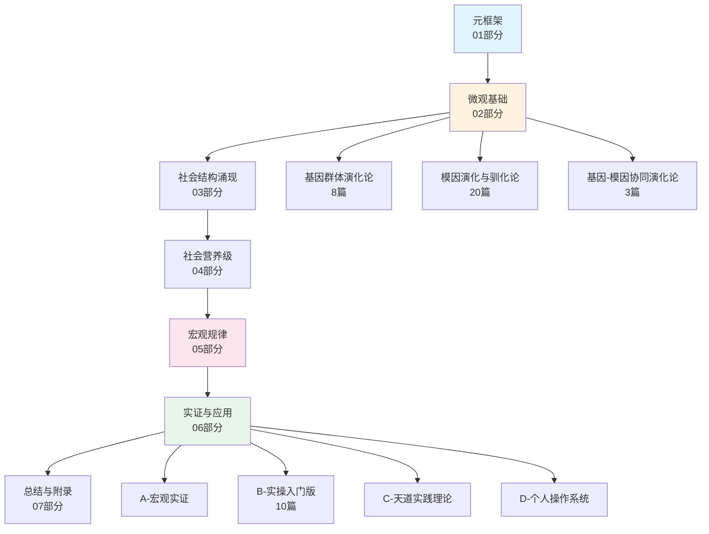

# 阅读地图

> 全量内容导航。每条路线标注预计阅读时间，帮你找到最适合自己的入口。

---

## 快速路线（2小时速览）

如果你只想快速了解这套理论在说什么：

| 序号 | 文章 | 预计时长 | 核心问题 |
|------|------|---------|---------|
| 1 | [天道理论一页纸极简版](../07-第七部分-总结与附录/7.7-天道理论一页纸极简版.md) | 5min | 全书骨架是什么？ |
| 2 | [自序：为笼中人递一把锯子](01-自序-为笼中人递一把锯子.md) | 15min | 作者为什么写这套理论？ |
| 3 | [人性本质：基因-模因双重编码](../02-第二部分-微观基础/02-1-基因群体演化论/2.1-3-人性本质-基因-模因双重编码.md) | 20min | 人到底是什么？ |
| 4 | [五大驯化体系](../02-第二部分-微观基础/02-2-模因演化与驯化论/2.2-5-五大驯化体系.md) | 25min | 谁在控制你？ |
| 5 | [灵视与反驯化](../02-第二部分-微观基础/02-2-模因演化与驯化论/2.2-7-灵视与反驯化.md) | 30min | 怎么看清+怎么做？ |

---

## 完整路线图

---

## 按问题找入口

| 你的问题 | 推荐入口 |
|---------|---------|
| "我为什么总是控制不住自己？" | [实操入门：停一下](../06-第六部分-实证与应用/B-实操引导-入门版/01-中断.md) |
| "谁在操控我的想法？" | [五大驯化体系](../02-第二部分-微观基础/02-2-模因演化与驯化论/2.2-5-五大驯化体系.md) |
| "看清了之后怎么办？" | [灵视与反驯化·反驯化五步法](../02-第二部分-微观基础/02-2-模因演化与驯化论/2.2-7-灵视与反驯化.md) |
| "看完很空虚怎么办？" | [正向价值锚定](../02-第二部分-微观基础/02-2-模因演化与驯化论/2.2-11-正向价值锚定-解构之后的重建.md) |
| "社会为什么总是不公？" | [社会营养级理论基础](../04-第四部分-中观结构-社会营养级理论/4.0-社会营养级理论基础.md) |
| "历史为什么总在重复？" | [掠夺性天道：历史周期律](../05-第五部分-宏观规律/5.0-低阶天道：历史周期律.md) |
| "有没有可能跳出循环？" | [共生性天道：文明升级路径](../05-第五部分-宏观规律/5.1-高阶天道-文明升级路径.md) |
| "我想系统化地改变自己" | [D系列：个人操作系统](../06-第六部分-实证与应用/D-个人操作系统/) |
| "我想分析一部作品在传递什么" | [作品立场分析器](../../.agents/skills/stance-analyzer/) |

---

## 各部分详情

### 01 · 元框架
理论定位与核心问题。四条公理的推导与论证。

### 02 · 微观基础
- **02-1 基因群体演化论**（8篇）：从基因视角重新理解人的行为
- **02-2 模因演化与驯化论**（20篇）：驯化机制、灵视三律、反驯化五步法
- **02-3 基因-模因协同演化论**（3篇）：两个群体如何共同塑造人

### 03 · 社会结构涌现机制
三个完整案例：美国快乐教育、苏联计划经济、英国圈地运动

### 04 · 社会营养级理论
社会的能量流动结构：生产层→传递层→富集层

### 05 · 宏观规律
- **5.0 掠夺性天道**：历史周期律的底层机制
- **5.1 共生性天道**：跳出周期律的条件与路径

### 06 · 实证与应用
- **A-宏观实证**：用理论分析真实社会现象
- **B-实操入门版**（10篇）：今天就能开始的最小行动
- **C-天道实践理论**：系统化的实践框架
- **D-个人操作系统**：完整的自我管理工具

### 07 · 总结与附录
理论收束、术语表、公理体系、定理体系、参考文献
