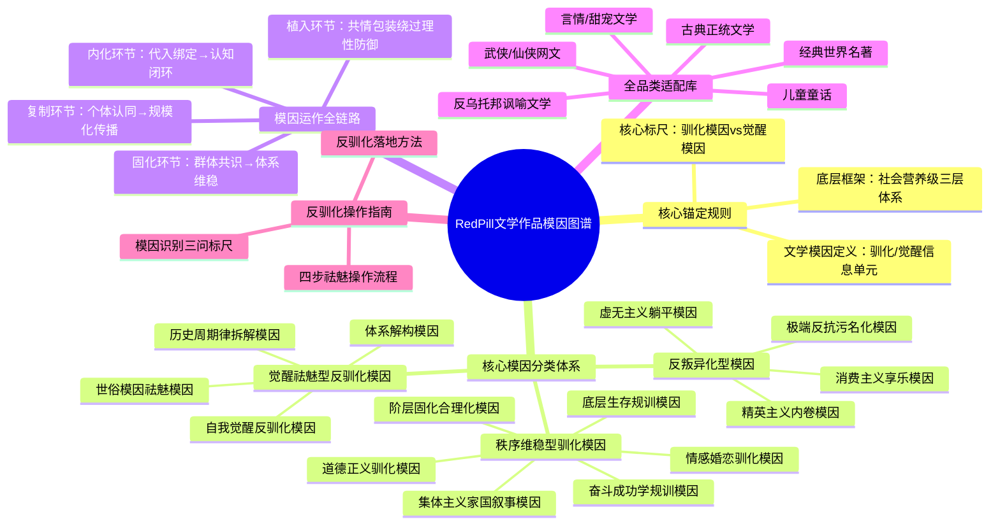

# 让大模型绘制RedPill框架文学作品模因图谱：全流程可落地方案

核心前提：所有绘制动作**必须锚定你之前梳理的RedPill天道理论核心框架**，避免大模型生成泛泛的文学主题分析。整套方案分为「2种核心绘制形态、前置锚定规则、分场景可复制提示词、校验优化方法、适配技巧」5个部分，拿来就能直接用。

---

## 一、先明确：大模型可绘制的2种核心图谱形态

先对齐预期，不同形态对应不同的大模型能力与使用场景，按需选择即可：

|图谱形态|核心用途|适配大模型|可控性|
|---|---|---|---|
|结构化文本模因图谱|核心落地形态，精准拆解模因的定义、分类、运作逻辑、驯化闭环、反驯化方法，完全适配RedPill理论|所有文本大模型（豆包、GPT、Claude等）|极高，可完全锁定规则|
|可视化图形模因图谱|直观呈现层级、流程、矩阵关系，包括思维导图、层级图、驯化流程图、对比矩阵图|支持Mermaid语法的文本大模型（豆包4.0、GPT-4o、Claude 3）、AI绘图模型（Midjourney、SD）|中高，需规范语法与提示词|
---

## 二、第一步：必须先做的「锚定规则投喂」（核心前提，不做必跑偏）

大模型默认对RedPill专属的模因框架无认知，直接让它生成会变成通用文学赏析。**每次绘制前，必须先把以下规则喂给大模型，锁定核心边界**，可直接复制使用：

```Plain Text

【必须100%严格遵守的RedPill文学模因图谱锚定规则】
1.  核心定义：文学作品模因，是依托叙事、人物、情节、审美传播的，具备自我复制、驯化宿主、规训行为属性的文化信息单元；它以故事与共情为特洛伊木马，绕过理性防御，要么是社会体系的软驯化工具，要么是推动认知觉醒的反驯化载体。
2.  核心判断标尺：所有模因必须按服务对象明确二分，严禁模糊边界：
    - 驯化模因：服务社会营养级体系（富集层/顶层），维护现有层级秩序，驯化个体成为适配系统的耗材
    - 觉醒模因：服务个体认知主权，拆解体系虚伪性，推动反驯化与意识独立
3.  底层锚定框架：所有分析必须严格对应社会营养级三层体系（生产层/底层、传递层/中层、富集层/顶层），明确模因的目标驯化人群、作用层级与利益服务方。
4.  绝对禁止项：严禁将模因分析等同于文学主题、思想内容、艺术特色赏析，所有内容必须紧扣「模因的复制-植入-驯化-维稳/觉醒」全链路，不得脱离RedPill核心逻辑。
```

---

## 三、分场景全流程绘制方案+可直接复制的提示词模板

### 场景1：生成「全品类通用文学模因图谱」（完整体系版）

对应你之前梳理的7大模块完整图谱，适合搭建整体框架，一次性生成完整体系。

#### 完整提示词（直接复制使用，替换括号内的自定义要求）

```Plain Text

请严格遵守我之前投喂的【RedPill文学模因图谱锚定规则】，生成一套完整的全品类通用文学作品模因图谱，输出格式为Markdown结构化文本，具体要求如下：
1.  图谱核心结构必须包含以下7个模块，形成完整逻辑闭环：
    模块1：核心定义与底层锚定规则（精简版，严格遵守前置规则）
    模块2：核心模因分类体系（按三大核心维度划分）
        - 第一维度（核心）：按功能属性分为「秩序维稳型驯化模因、反叛异化型模因、觉醒祛魅型反驯化模因」三大类，每类必须包含子分类、核心内核、驯化/觉醒目标、对应社会营养级作用层级
        - 第二维度：按作用层级，对应社会营养级三层体系，明确不同模因的目标驯化人群
        - 第三维度：按内容属性做辅助分类，方便检索
    模块3：模因传播与驯化全闭环路径，拆解从植入→内化→复制→固化的完整链路
    模块4：全品类文学载体模因特征对照表，覆盖主流文学品类，每个品类明确核心模因属性、驯化/觉醒目标、代表作品
    模块5：典型案例拆解库，正反案例对比，每个案例包含作品名、核心模因、完整逻辑、对应RedPill理论落点
    模块6：模因祛魅与反驯化操作框架，包含识别标尺、落地步骤、应用指南
    模块7：模因演化与新形态适配，覆盖新媒体时代的文学模因新载体
2.  所有内容必须100%紧扣RedPill核心逻辑，严禁出现任何无关的文学赏析内容
3.  层级清晰，用Markdown分级标题、列表、表格规范排版，方便阅读与二次编辑
```

### 场景2：生成「单作品深度模因图谱」（高频使用场景）

适合针对某一部具体作品（如《西游记》《平凡的世界》）做精准拆解，是最常用的功能。

#### 完整提示词（直接复制使用，替换作品名即可）

```Plain Text

请严格遵守我之前投喂的【RedPill文学模因图谱锚定规则】，为《[此处替换为目标作品名，如《金瓶梅》]》生成完整的深度模因图谱，输出格式为Markdown结构化文本，具体要求如下：
1.  图谱必须包含以下6个固定模块，形成完整拆解闭环：
    模块1：作品基础信息：作品名、作者、核心受众、所属文学品类、整体模因属性定位（以驯化为主/以觉醒为主/异化模因）
    模块2：核心模因总览：明确该作品的核心服务对象、整体驯化/觉醒底层逻辑、核心传播目标
    模块3：核心模因分类深度拆解：严格按「秩序维稳型驯化模因、反叛异化型模因、觉醒祛魅型反驯化模因」三大类划分，每个模因必须包含：
        - 模因名称
        - 核心内核
        - 作品中的具体载体（对应情节、人物设定、结局、经典台词）
        - 完整驯化/觉醒运作逻辑
        - 对应社会营养级的作用层级与目标驯化人群
    模块4：该作品模因的传播与驯化全链路：拆解从植入→内化→复制→社会共识固化的完整闭环
    模块5：模因祛魅与反驯化操作指南：针对该作品的核心驯化模因，给出可落地的识别-解构-祛魅操作方法
    模块6：RedPill理论对应落点：明确该作品对应天道理论、社会营养级、模因驯化的核心匹配点
2.  绝对禁止输出任何与模因无关的文学赏析、艺术评价、作者生平、剧情梗概内容
3.  层级清晰，用Markdown分级标题、列表规范排版
```

### 场景3：生成「可视化图形模因图谱」

#### 子场景3.1：用Mermaid生成可直接渲染的思维导图/流程图（推荐，零门槛）

目前豆包、GPT-4o、Claude 3均支持Mermaid语法直接渲染，复制代码即可生成高清可视化图，可控性极强。

##### 通用提示词（直接复制使用）

```Plain Text

请严格遵守我之前投喂的【RedPill文学模因图谱锚定规则】，生成对应图谱的Mermaid代码，要求如下：
1.  图谱类型：[此处替换类型，如：思维导图、层级结构图、模因驯化全链路流程图、驯化vs觉醒模因对比矩阵图]
2.  核心结构严格对应RedPill文学模因图谱的核心框架，层级清晰，最多4级分支，避免过于复杂
3.  严格紧扣驯化/觉醒核心二分法、社会营养级三层体系，严禁加入无关内容
4.  输出完整可直接渲染的Mermaid代码，格式为```mermaid ... ```，代码无语法错误
```

##### 示例：生成的全品类模因图谱思维导图Mermaid代码（可直接复制渲染）


#### 子场景3.2：用AI绘图模型生成高清图谱海报（Midjourney/SD）

先用文本大模型生成图谱的核心结构与关键词，再转换成以下提示词，即可生成可视化海报：

```Plain Text

高清扁平化专业信息图谱海报，RedPill文学作品模因图谱，核心结构分为三大并列模块：秩序维稳型驯化模因、反叛异化型模因、觉醒祛魅型反驯化模因，每个模块标注核心子分类与关键词，底部标注社会营养级三层体系（生产层、传递层、富集层），左侧嵌入模因驯化全链路流程图，右侧标注反驯化核心标尺，配色简约高级，黑白色调为主，红色点缀核心关键词，所有文字清晰可辨，层级结构分明，无多余装饰，学术严谨风格，8K超高清，矢量图 --ar 16:9 --style raw
```

---

## 四、生成后校验&优化方法（解决大模型跑偏问题）

如果生成的内容不符合要求，直接用以下精准指令修正，无需重新生成：

1. 若大模型把模因分析变成了文学赏析：

指令：「请严格遵守RedPill锚定规则，删除所有文学主题、艺术特色、剧情梗概内容，所有内容必须紧扣「模因的驯化/觉醒逻辑、服务对象、作用层级」，重新生成对应模块。」

1. 若分类混乱、脱离核心框架：

指令：「请严格按照「秩序维稳型驯化模因、反叛异化型模因、觉醒祛魅型反驯化模因」三大核心分类重新梳理，每个模因必须明确标注服务对象与对应社会营养级层级。」

1. 若缺少闭环逻辑、只有分类没有落地：

指令：「请补充该图谱的模因运作全链路、反驯化操作指南两个模块，严格遵循RedPill核心逻辑，形成完整的「识别-解构-祛魅-反驯化」闭环。」

---

## 五、不同大模型的适配技巧

1. **高能力文本大模型（豆包4.0、GPT-4o、Claude 3 Opus）**：可一次性投喂锚定规则+完整提示词，直接生成全量图谱，支持复杂Mermaid代码生成，上下文窗口充足，无需拆分步骤。

2. **轻量文本大模型（豆包标准版、GPT-3.5）**：拆分步骤生成，先投喂锚定规则，再分模块生成（先核心框架，再分类拆解，再案例，最后可视化），避免一次性要求过多导致内容遗漏、规则失效。

3. **AI绘图模型（Midjourney、SD）**：不要直接输入长文本，先用文本大模型提炼核心结构、层级、关键词，再转换成精简的绘图提示词，重点标注「文字清晰可辨、层级结构分明」，避免生成乱码文字。

---

## 六、核心避坑指南

1. **绝对不能跳过锚定规则**：直接让大模型生成「文学模因图谱」，100%会变成通用文学分析，必须先锁定RedPill核心边界。

2. **不要用模糊指令**：避免「给我画一个文学模因图谱」这类模糊需求，必须明确「图谱类型、核心框架、输出格式、禁止项」，越精准越符合预期。

3. **不要混淆模因与主题**：比如《西游记》的主题是「取经修行」，但核心模因是「反叛必遭惩罚、归顺体系才是正途」，必须始终锚定「模因的驯化/觉醒本质」，而非表面主题。

4. **不要脱离闭环**：完整的图谱必须从定义到反驯化形成闭环，不能只有分类拆解，否则就只是文学分析，不是RedPill框架下的模因工具。
> （注：文档部分内容可能由 AI 生成）